# 第1章 课程导学

## 开启MongoDB入门之旅

    文档 http://www.mongoing.com/
    
# 第2章 初见MongoDB

## MongoDB是什么

非关系数据库

    redis 键值存储
    Cassandra 列存储
    objectivity/db 对象存储
    neo4j 图形存储
    mongodb 文档存储
    
mongo数据库结构,同一个集合的文档可以完成不同的字段

    数据库-->集合-->文档(json)
    
## Docker中运行MongoDB

    docker pull mongo:4
    docker images
    
启动mongo
    
    docker run --name mymongo -v /mymongo/data:/data/db -d mongo:4
    
查看容器

    docker ps
    
查看数据库日志

    docker logs mymongo
    
mongo express是基于网络的mongodb数据库管理界面

    docker pull mongo-express
    docker run --link mymongo:mongo -p 8081:8081 mongo-express

浏览器这样打开mongo express

    ip地址:8081
    
## 初见mongo shell:最靠谱的客户端

mongo基于JavaScript的客户端工具

    docker exec -it mymongo mongo
    
## mongo shell的共同语言 :盟友JavaScript

    mongo shell可以接受JavaScript的语法
    
    print("hello")
    exit # 退出
    
# 第3章 MongoDB基本操作之CRUD

## 原来MongoDB文档长这样

基本操作
    
    create 创建
    read 读取
    update 更新
    belete 删除
    
文档主键_id,每一篇文档必有字段

    文档主键的唯一性
    支持所有数据类型(数组除外)
    复合主键
    
对象主键objectid

    默认生成文档主键
    可以快速生成的12字节id
    包含创建时间
    
注意事项:对象主键objectid
    
    如果多个文档同一秒中存入数据中,顺序存在不同情况
    对象主键是客户端驱动生成的,如果客户端的系统时间不同,也会影响文档顺序
    
创建文档

    db.collection.insert()
    db.collection.save()

## 我的第一篇MongoDB文档insertOne和insertMany

使用test数据库

    use test
    
查看test数据库中的集合

    show collections
    
### 创建第一个文档

    db.collection.insertOne()
    
    db.<collection>.insertOne(
        <document>,
        {
            writeConcern:<document>
        }
    )
    
    <collection>要替换成文档将要写入的集合
    <document>要替换成将要写入的文档本身
    writeConcern文档定义了本次文档创建操作的安全写级别
        简单的说,安全写级别用来判断一次数据库写入操作是否成功;
        安全写级别越高,丢失数据的风险就越低,然而写入操作的延迟也可能更高;
        如果不提供writeConcern文档,mongodb使用默认的安全写级别
        
准备写入数据库的文档

    {
        _id:"account1",
        name:"alice",
        balance:100
    }
    
将文档写入accounts集合,这里没有writeConcern,我们使用默认安全写级别

    db.accounts.insertOne(
        {
            _id:"account1",
            name:"alice",
            balance:100
        }
    )
        
返回结果
    
    { "acknowledged" : true, "insertedId" : "account1" }
    
    acknowledged : true 表示安全写级别被启用,默认的安全写级别
    insertedId显示了被写入的文档的_id
    
等一下,我们并没有创建过accounts集合啊

查看一下现在的集合列表

    show collections
    
    打印,会自动创建相应的集合
    accounts
    
如果使用重复的_id创建一个新的文档会造成错误

    db.accounts.insertOne(
        {
            _id:"account1",
            name:"bob",
            balance:50
        }
    )
    
打印出的错误信息

    2019-08-03T15:14:28.613+0000 E QUERY    [js] WriteError: E11000 duplicate key error collection: test.accounts index: _id_ dup key: { : "account1" } :
    WriteError({
        "index" : 0,
        "code" : 11000,
        "errmsg" : "E11000 duplicate key error collection: test.accounts index: _id_ dup key: { : \"account1\" }",
        "op" : {
            "_id" : "account1",
            "name" : "bob",
            "balance" : 50
        }
    })
    WriteError@src/mongo/shell/bulk_api.js:461:48
    Bulk/mergeBatchResults@src/mongo/shell/bulk_api.js:841:49
    Bulk/executeBatch@src/mongo/shell/bulk_api.js:906:13
    Bulk/this.execute@src/mongo/shell/bulk_api.js:1150:21
    DBCollection.prototype.insertOne@src/mongo/shell/crud_api.js:252:9
    @(shell):1:1

这样的错误信息有点凌乱!

    try{
            db.accounts.insertOne(
                {
                    _id:"account1",
                    name:"bob",
                    balance:50
                }
            )
        } catch(e){
            print(e)
        }
        
返回,可以看见尝试写入的文档信息,并报错duplicate key重复的文档主键

    WriteError({
        "index" : 0,
        "code" : 11000,
        "errmsg" : "E11000 duplicate key error collection: test.accounts index: _id_ dup key: { : \"account1\" }",
        "op" : {
            "_id" : "account1",
            "name" : "bob",
            "balance" : 50
        }
    })

其实自动生成_id主键,省去自己去实现主键_id

    db.accounts.insertOne(
        {
            name:"bob",
            balance:50
        }
    )
    
生成,mongodb自动生成了主键ObjectId("5d45a6153f559e4e1a7c6a5b")

    {
        "acknowledged" : true,
        "insertedId" : ObjectId("5d45a6153f559e4e1a7c6a5b")
    }

### 创建多个文档

    db.collection.insertMany()
    
    db.<collection>.insertMany(
        [<document1>,<document2>, ...]
        {
            writeConcern:<document>,
            ordered: <boolean>
        }
    )
    
    将多个文档作文一个数组传入 db.collection.insertMany()
    ordered:参数用来决定mongodb是否要按顺序来写入这些文档
        如果将ordered参数设置位false,mongodb可以打乱文档写入的顺序,以便优化写入操作的性能
        默认是true,那么mongodb会严格按照我们插入的顺序
        
准备写入数据库的文档
    
    {
        name: "charlie",
        balance: 500
    }
    
    {
        name: "david",
        balance: 200
    }
    
将文档写入accounts集合

    db.accounts.insertMany([
        {
            name: "charlie",
            balance: 500
        },
        
        {
            name: "david",
            balance: 200
        }
    ])
    
返回值

    {
        "acknowledged" : true,
        "insertedIds" : [
            ObjectId("5d45aa393f559e4e1a7c6a5c"),
            ObjectId("5d45aa393f559e4e1a7c6a5d")
        ]
    }

如果运行一个错误shell语法

    try{
            db.accounts.insertMany([
                {
                    _id:"account1",
                    name: "charlie",
                    balance: 500
                },
                
                {
                    name: "david",
                    balance: 200
                }]
            )
        } catch(e){
            print(e)
        }
        
返回错误 duplicate key,

    BulkWriteError({
        "writeErrors" : [
            {
                "index" : 0,
                "code" : 11000,
                "errmsg" : "E11000 duplicate key error collection: test.accounts index: _id_ dup key: { : \"account1\" }",
                "op" : {
                    "_id" : "account1",
                    "name" : "charlie",
                    "balance" : 500
                }
            }
        ],
        "writeConcernErrors" : [ ],
        "nInserted" : 0,
        "nUpserted" : 0,
        "nMatched" : 0,
        "nModified" : 0,
        "nRemoved" : 0,
        "upserted" : [ ]
    })

这里比单文档插入,返回的错误信息多了

        "writeConcernErrors" : [ ],
        "nInserted" : 0, # 创建多个文档的操作,写入了多少的文档为0个
        "nUpserted" : 0, # 
        "nMatched" : 0,
        "nModified" : 0,
        "nRemoved" : 0,
        "upserted" : [ ]
        
如果这里我们用 ordered: false 改变写入的顺序为"乱序写入"

    try{
            db.accounts.insertMany([
                {
                    _id:"account1",
                    name: "charlie",
                    balance: 500
                },
                
                {
                    name: "david",
                    balance: 200
                }],
                {
                    ordered: false
                }
            )
        } catch(e){
            print(e)
        }
        
返回的信息 "nInserted" : 1,

	"writeConcernErrors" : [ ],
	"nInserted" : 1,
	"nUpserted" : 0,
	"nMatched" : 0,
	"nModified" : 0,
	"nRemoved" : 0,
	"upserted" : [ ]

居然有其中1片文档写入了数据库.

总结:
    
    在顺序写入时,一旦遇到错误,操作便会退出,剩余的文档无论正确与否,都不会写入
    在乱序写入时,ordered: false 改变写入的顺序为"乱序写入",可保证正确的文档内容能插入数据库

## 创建新文档的更多姿势

### insert命令

    db.<collection>.insert()既可以写入一个单独的文档,也可以写入多个文档

    db.<collection>.insert(
        <document or array of documents>,
        {
            writeConcern:<document>,
            ordered: <boolean>
        }
    )
    
将文档写入accounts集合

    db.accounts.insert(
        {
            name: "george",
            balance: 10000
        }
    )
    
返回写入文档数量

    WriteResult({ "nInserted" : 1 })
    
如果是错误的文档命令

    try{
            db.accounts.insert([
                {
                    _id:"account1",
                    name: "charlie",
                    balance: 500
                },
                
                {
                    name: "david",
                    balance: 200
                }]
            )
        } catch(e){
            print(e)
        }
        
返回的错误信息

    BulkWriteResult({
        "writeErrors" : [
            {
                "index" : 0,
                "code" : 11000,
                "errmsg" : "E11000 duplicate key error collection: test.accounts index: _id_ dup key: { : \"account1\" }",
                "op" : {
                    "_id" : "account1",
                    "name" : "charlie",
                    "balance" : 500
                }
            }
        ],
        "writeConcernErrors" : [ ],
        "nInserted" : 0,
        "nUpserted" : 0,
        "nMatched" : 0,
        "nModified" : 0,
        "nRemoved" : 0,
        "upserted" : [ ]
    })

### insertOne和insertMany和insert的区别

1. 三个命令返回的结果文档格式不一样如上显示效果

2. insertOne和insertMany命令不支持db.collection.explain()命令,insert支持

### save命令可以用来创建文档

    db.<collection>.save(
        <document>,
        {
            writeConcern:<document>
        }
    )
    
当save命令处理一个新文档的时候,它会调用insert()命令完成写入文档操作

所有 ```db.<collection>.save()``` 返回的结果文档与```db.<collection>.insert()```是一样的

### 文档主键_id

默认的对象主键objectId

我们可以创建一个objectId对象主键

    ObjectId()

也可以指定值创建一个对象主键

    ObjectId("5d45b4a87ef311e8c18bdd7f")
    
提取ObjectId的创建时间

    ObjectId("5d45b4a87ef311e8c18bdd7f").getTimestamp()
    
### 复合主键

可以使用文档作为文档主键

    db.accounts.insert(
        {
            _id:{accountNo: "001", type: "savings" },
            name: "george",
            balance: 10000
        }
    )
    
返回

    WriteResult({ "nInserted" : 1 })

这样创建是完成没有问题的,但是任然要满足主键的唯一性

但是我们如果调换复合主键内容顺序如下

    db.accounts.insert(
        {
            _id:{ type: "savings", accountNo: "001"},
            name: "irenne",
            balance: 80
        }
    )

返回

    WriteResult({ "nInserted" : 1 })

发现没有问题!

## 关于读取文档

读取文档

    db.collection.find() 
        #匹配查询
        #操作符
        
游标

    查询操作返回的接货游标
    游标的迭代与操作
    
投射

    只返回部分字段
    内嵌文档的投射
    数组的投射
    
## 最直接的匹配查询和比较操作符

开始读取文档 db.collection.find()
  
    db.collection.find(<query>, <projection>)
    
    <query>文档定义了读取操作时筛选文档条件
    <projection>文档定义了堆读取结果进行投射操作
    
既不筛选,也不投射

    db.accounts.find()
    
让读取的文档格式化,更清楚的显示文档

    db.accounts.find().pretty()

###匹配查询

    db.accounts.find({"name" : "alice"})
    db.accounts.find({"name" : "alice", "balance" : 100})
    db.accounts.find({"_id.type": "savings"}) # 复合主键查询
    
###比较操作符

```语法:{<field>:{$<operator>:<value>}}```

    $eq 匹配字段值相等
    $ne 匹配字段值不等
    $gt 匹配字段值大于
    $gte 匹配字段值大于或等于
    $lt 匹配字段值小于查询值
    $lte 匹配字段值小于或等于查询值
    
读取alice的银行账户文档

    db.accounts.find({"name" : {$eq: "alice"}})
    
读取不属于alice的银行账户文档

    db.accounts.find({"name" : {$ne: "alice"}})
    
读取余额不等于100的文档,这里要注意的是$ne操作符也会输出不存在该字段的文档

    db.accounts.find({"balance" : {$ne: "100"}})
    
读取余额大于100的银行账户文档

    db.accounts.find({"balance" : {$gt: 100}})
    
读取用户名字排在fred之前的银行账户文档

    db.accounts.find({"name" : {$lt: "george"}})
    
$in 匹配字段值与任意查询值相等,类似python in操作

    db.accounts.find({name:{$in:["alice", "bob"]}})

$nin 匹配字段值与任何查询值都不等类似python not in操作

    db.accounts.find({name:{$nin:["alice", "bob"]}})
    
读取账户类型不是储蓄账户的银行文档

    db.accounts.find({"_id.type": {$nin: ["savings"]}}) # 复合主键查询
    
## 逻辑操作符

### $not 匹配筛选条件不成立的文档

    语法:{<field>:{$not: {<operator-expression>}}}
    
    读取余额不小于500的银行账户文档
    
        db.accounts.find({"balance": {$not: {$lt:500}}})
    
    $not也会筛选出并不包含查询字段的文档
    
        db.accounts.find({"_id.type": {$not: {$eq: "savings"}}}) # 复合主键查询

### $and 匹配多个筛选条件全部成立的文档

    语法:{$and:[{<expression1>}, {<expression12>}, {<expression3>}]}
    
    读取余额大于100并且用户姓名排在fred之后的银行文档
    
        db.accounts.find({$and: 
                [{"balance": {$gt:100}}, 
                {"name" : {$gt: "george"}}]
            })
            
    当筛选条件应用在不同的字段上时,可以省略$and操作符
        
        db.accounts.find({
            "balance": {$gt:100}, 
            "name" : {$gt: "alice"}
         })
         
    当筛选条件应用在同一个字段上时,也可以简化命令,读取余额大于100并且小于500的银行账户文档
    
        db.accounts.find({
            "balance": {$gt:100, $lt: 500}
         })

### $or 匹配至少一个筛选条件成立的文档

    语法: {$or:[{<expression1>}, {<expression12>}, {<expression3>}]}

    读取属于alice或者charlie的银行账户文档
    
        db.accounts.find({$or: 
                [{"name": {$eq: "alice"}}, 
                {"name" : {$eq: "george"}}]
            })
            
    当所有筛选条件使用的都是$eq操作符时,$or和$in的效果是相同的
    
        db.accounts.find({
            "name": {$in: ["alice", "george"]}
         })
         
    读取余额小于100或者大于500的银行账户文档
    
        db.accounts.find({$or: [
            {balance:{$lt:100}},
            {balance:{$gt:500}}
        ]})

### $nor 匹配多个筛选条件全部不成立的文档

    语法: {$nor:[{<expression1>}, {<expression12>}, {<expression3>}]}
    
    读取不属于alice和charlie且余额不小于100的银行账户文档
    
        db.accounts.find({$nor: [
            {name: "alice"},
            {name: "george"},
            {balance:{$gt:500}}
        ]})
        
    $nor也会查询出并不包含查询字段的文档
    
        db.accounts.find({$nor: [
            {"_id.type": "savings"},
            {balance: {$gt: 500}}
        ]})

## 字段操作符

### $exists 匹配包含查询字段的文档

    语法:{field: {$exists: <boolean>}}
    
    读取包含账户类型字段的银行账户文档
    
        db.accounts.find({
            "_id.type": {$exists: true}
        })
        
    回想一下,之前的查询会返回并不包含查询字段的文档,$exists能更加准确返回结果
    
        db.accounts.find({
            "_id.type": {
                $ne: "alice",
                $exists: true
            }
        })

### $type 匹配字段类型符合查询值的文档

    语法: 
        {field: {$type: <BSON type>}}
        {field: {$type: [<BSON type1>, <BSON type2>, <BSON type3>]}}
        
    读取文档主键是字符串的银行账户文档
    
        db.accounts.find({
            _id:{$type: "string"}
        })
    
    读取文档主键是对象主键或者是符合主键的银行账户文档
    
        db.accounts.find({
            _id:{$type: [
                "object", # 对象
                "objectId" # 对象主键
            ]}
        })   
    
    读取用户姓名是null的银行账户文档
    
        db.accounts.find({name: {$type: "null"}})
    
    也可以使用对应的bson类型序号作为$type操作符的参数
    
        db.accounts.find({name: {$type: 2}})
    
## 数组操作符

### 数组操作符$all

    语法 {<field>:{$all: [<valie1>, <valie2>]}}
    
    创建包含数组和嵌套数组的文档
    
        db.accounts.insert([
            {
                name: "jack",
                balance:20000,
                contact: [1000000, "Alabama", "US"]
            },{
                name: "karen",
                balance: 2500,
                contact: [["22222222", "3333333"], "Beijing", "China"]
            }
        ])
    
    读取联系地址位于中国北京的银行账户的文档
        db.accounts.find({contact: {$all:["China", "Beijing"]}})
        
    读取联系电话包含22222222和3333333的银行账户的文档
        db.accounts.find({contact: {$all:[["22222222", "3333333"]]}})
    
### 数组操作符 $elemMatch

    语法 {<field>:{$elemMatch: [<query1>, <query2>]}}
    
    读取联系电话范围在10000000~20000000之间银行账户的文档
        db.accounts.find({contact: {$elemMatch:{$gt: 100000, $lt: 20000000}}})
        
    注意点
        字符串之间比较各个字符的ascii值
        
    读取包含一个在1000000至2000000之间,和一个在20000000至30000000之间的联系电话的银行账户文档
    
        db.accounts.find(
            contact:{$all:[
                {$elemMatch:{$gt: "100000", $lt: "200000"}},
                {$elemMatch:{$gt: "200000", $lt: "300000"}},
            ]}
        )

## 运算操作符

### $regex 匹配满足正则表达式的文档
    
    语法:
        {<field>: {: /pattgern/,: '<options>'}}
        {<field>: {: /pattgern/<options>}}
        
    兼容 pcre v8.41正则表达式库
    
    在和$in操作符一起使用是,只能使用/pattgern/<options>
    
    读取用户姓名以c或者j开头的银行账户的文档
        db.accounts.find({name:{$in:[ /^c/, /^j/ ]}})
        
    读取用户姓名包含LIE(不区分大小写)的银行账户文档
        db.accounts.find({name:{$regex: /LIE/, $options: 'i'}})
        
## 文档游标

```db.collection.find()```返回一个文档集合游标

在不迭代游标的情况下,只列出前20个文档

    var myCursor = db.accounts.find()
    
    myCursor
        myCursor是一个变量
    
    打印出前20个文档
    
    { "_id" : "account1", "name" : "alice", "balance" : 100 }
    { "_id" : ObjectId("5d45a6153f559e4e1a7c6a5b"), "name" : "bob", "balance" : 50 }
    { "_id" : ObjectId("5d45aa393f559e4e1a7c6a5c"), "name" : "charlie", "balance" : 500 }
    { "_id" : ObjectId("5d45aa393f559e4e1a7c6a5d"), "name" : "david", "balance" : 200 }
    { "_id" : ObjectId("5d45ac6d3f559e4e1a7c6a5f"), "name" : "david", "balance" : 200 }
    { "_id" : ObjectId("5d45af2d3f559e4e1a7c6a60"), "name" : "george", "balance" : 10000 }
    { "_id" : { "accountNo" : "001", "type" : "savings" }, "name" : "george", "balance" : 10000 }
    { "_id" : { "type" : "savings", "accountNo" : "001" }, "name" : "irenne", "balance" : 80 }
    { "_id" : ObjectId("5d469d60e11da07278ffcb7b"), "name" : "jack", "balance" : 20000, "contact" : [ "1111111", "Alabama", "US" ] }
    { "_id" : ObjectId("5d469d60e11da07278ffcb7c"), "name" : "karen", "balance" : 2500, "contact" : [ [ "22222222", "3333333" ], "Beijing", "China" ] }
    { "_id" : ObjectId("5d46a26db5af1b6338cbc574"), "name" : "jack", "balance" : 20000, "contact" : [ 1000000, "Alabama", "US" ] }
    { "_id" : ObjectId("5d46a26db5af1b6338cbc575"), "name" : "karen", "balance" : 2500, "contact" : [ [ "22222222", "3333333" ], "Beijing", "China" ] }

我们也可以使用游标的下标直接访问文档集合中的某个文档

    var myCursor = db.accounts.find()
    myCursor[1]
    
    {
        "_id" : ObjectId("5d45a6153f559e4e1a7c6a5b"),
        "name" : "bob",
        "balance" : 50
    }

游标遍历完所有的文档后,或者在10分钟之后,游标便会自动关闭

可以使用 noCursorTimeout()函数来保持游标一直有效

    var myCursor = db.accounts.find().noCursorTimeout()
    
在这之后,在不遍历游标的情况下,你需要主动关闭游标

    myCursor.close()
    
## 文档游标函数

cursor.hasNext() 是否有下一个游标

cursor.next() 下一个游标

遍历游标

    var myCursor = db.accounts.find({name: "george"});
    while( myCursor.hasNext()){
        printjson(myCursor.next());
    }
    
更方便的遍历游标 ```cursor.forEach(<function>)```

    var myCursor = db.accounts.find({name: "george"});
    myCursor.forEach(printjson)
    
```cursor.limit(<number>)```只是返回要求的文档

    db.accounts.find({name: "george"}).limit(1);

```cursor.skip(<offset>)```跳过第一篇,返回第一篇之后的文档

    db.accounts.find({name: "george"}).skip(1);
    
使用cursor.limit(0)会返回什么结果呢?
    
    db.accounts.find({name: "george"}).limit(0);
    
    证明:不使用limit操作
    
```cursor.count(<applySkipLimit>)```

默认情况下,<applySkipLimit>为false,即cursor.count()不会考虑cursor.skip和cursor.limit的效果

    db.accounts.find({name: "george"}).limit(1).count();
    返回
        2
    db.accounts.find({name: "george"}).limit(1).count(true);
    返回
        1
        
在不提供筛选条件时, cursor.count()会从集合的元数据Metedate中取得结果

    db.accounts.find().count();
    
当数据库分布式结构较为复杂时,元数据中的文档数量可能不准确,在这种情况下,应该避免应用不提供筛选条件的cursor.count()函数,而使用聚合管道来计算的文档数量

```cursor.sort(<document>)```排序

    这里的<document>定义了排序的要求
    语法: {field: ordering} 1表示有小及大的正向排序, -1表示逆向排序
    
    按照余额从到小,用户姓名按字母排序的方式排列银行账户文档
        db.accounts.find().sort({balance: -1, name: 1});
    
    读取余额最大的银行账户文档
        db.accounts.find().sort({balance: -1}).limit(1);
        
这里要提到的是执行顺序

    cursor.skip(), 
    cursor.limit(),
    cursor.sort()
    
cursor.skip()在cursor.limit()之前执行

    db.accounts.find().limit(5).skip(3)
    
    按照正常执行顺序应该返回2篇文档,但是这里返回了5篇文档
    
cursor.sort()在cursor.skip()和cursor.limit()之前执行

    db.accounts.find().limit(5).skip(3).sort({balance: -1})
    
    其实执行顺序是
    
    db.accounts.find().sort({balance: -1}).skip(3).limit(5)
    
## 文档投影

```db.accounts.find(<query>, <projection>)```

不使用投影文档,db.accounts.find()返回符合筛选条件的完整的文档,而使用投影可以有选择的返回文档中的部分字段

语法:{field: inclusion}

1.表示返回字段, 0表示不返回字段

只返回银行账户文档中的用户姓名

    db.accounts.find({}, {name: 1})
    
只返回银行账户文档中的用户姓名(不包括主键)

    db.accounts.find({}, {name: 1, _id:0})
    
不返回银行账户文档中的用户姓名(不返回主键)

    db.accounts.find({}, {name: 0, _id:0})
    
注意点

    db.accounts.find({}, {name: 1, balance: 0 _id:0})
    报错
    除了文档主键之外,我们不可以在投影文档中混合使用包含和不包含这两种投影操作.
    
在数组字段上使用投影$slice

    $slice操作符可以返回数组字段中的部分元素
    
    db.accounts.find({}, {_id: 0, name:1, contact: 1})
    
    返回数组中第一个元素slice: 1
    db.accounts.find({}, {_id: 0, name:1, contact: {$slice: 1}})
    
    返回数组中倒数一个元素slice: -1
    db.accounts.find({}, {_id: 0, name:1, contact: {$slice: -1}})
    
    返回数组中倒数2个元素slice: -2
    db.accounts.find({}, {_id: 0, name:1, contact: {$slice: -2}})
    
    slice: [1, 2] 1是skip操作, 2是limit操作
    db.accounts.find({}, {_id: 0, name:1, contact: {$slice: [1, 2]}})
    
在数组字段上使用投影$elemMatch

    $elemMatch和$操作符可以返回数组字段中满足筛选条件的第一个元素
        db.accounts.find({}, {
            _id:0, name:1,
            contact: {$elemMatch:{$gt: "Alabama"}}
        })
    
    一般情况下我们会先定义筛选条件,在投影时没有新的筛选条件,就可以用$,不需要自定义$elemMatch筛选
        db.accounts.find(
            {contact: {$gt: "Alabama"}}, 
            { _id:0, name:1,"contact.$": 1}
        )
        
## 更新文档

### 更新整篇文档

db.collection.update()

语法:```db.<collection>.update(<query>, <update>, <options>)```

    <query> 文档定义了更新操作筛选文档的条件
    <update> 文档定义了更新的内容
    <options> 文档声明了一些更新操作的参数
    
将alice的账户余额更改为123

    db.accounts.update({name: "alice"}, {name: "alice", balance:123})
    返回数据
    WriteResult({ "nMatched" : 1, "nUpserted" : 0, "nModified" : 1 })
        nMatched 符合更新的文档多少篇
        nModified 更新了多少文档
        
几个需要注意的问题

    文档主键_id是不可以更改的
    我们之前使用的<update>文档并没有包含_id字段
    在这种情况下,文档的_id字段自然不会被更改
    如果我们在<update>文档包含_id字段,则_id值一定要和被更新的文档_id值保持一致
    
查询账户余额在20到80之间的文档

    db.accounts.find({balance:{$gt:20, $lt: 500}})
        发现查询出5篇文档
    
    在更新文档试试
    db.accounts.update({balance:{$gt:20, $lt: 500}}, {name: "bill", balance: 50, gender: "M"})
        发现只更新了1篇文档
        
    也就是说更新整片文档的操作只能应用在单一文档上
    
### 更新特定字段

    $set 更新或新增字段
    $unset 删除字段
    $rename 重命名字段
    $inc 加减字段值
    $mul 相乘字段值
    $min 比较减小字段值
    $max 比较增大字段值
    
$set 更新或新增字段

语法: ```{$set: {<field1>:<values1>, ....}}```

    查看jack的银行账户文档
    db.accounts.find({name: "jack"}).pretty()
    
    更新jack的银行账户余额和开户信息
    db.accounts.update(
            {name: "jack"},
            {$set: {
                balance: 3000,
                info: {
                    dateOpened: new Date("2016-05-18T16:00:00Z"),
                    branch: "branch1"
                }
            }}
        )
        
    返回
    WriteResult({ "nMatched" : 1, "nUpserted" : 0, "nModified" : 1 })
    
    更新或新增内嵌文档的字段,更新jack的银行账户的开户时间
    db.accounts.update(
        {name: "jack"},
        {$set: {
            "info.dateOpened": new Date("2017-05-18T16:00:00Z"),
        }}
    )
    
    更新或新增数组内字段
    db.accounts.update(
        {name: "jack"},
        {$set: {
            "contact.0": "66666666",
        }}
    )
    
    新增数组内字段
    db.accounts.update(
        {name: "jack"},
        {$set: {
            "contact.3": "new contact",
        }}
    )
    
    如果数组元素是5 contact.5
    db.accounts.update(
        {name: "jack"},
        {$set: {
            "contact.5": "new contact",
        }}
    )
    
        返回 ,发现是长度是6位,但是地5位是null
            "contact" : [
                "66666666",
                "Alabama",
                "US",
                "new contact",
                null,
                "new contact"
            ],

如果像现有数组字段范围以外的位置添加新值,数组字段的长度会扩大.未被赋值的数组成员将被设置为null

$unset 删除字段

语法: ```{$unset: {<field1>: "", ....}}```

    删除jack的银行余额和开户地点
    
        db.accounts.update(
            {name: "jack"},
            {$unset: {
                balance: "",
                "info.branch": ""
            }}
        )
    
        其实$unset命令中赋值""对操作结果并没有任何影响
    
        "info.branch": "dasdada" 也会删除这个字段
    
        如果$unset命令中字段根本不存在,那么文档内容将保持不变
    
    删除数组内的字段
    
        db.accounts.update(
            {name: "jack"},
            {$unset: {
                "contact.0": ""
            }}
        )
        
        当使用$unset 删除字段数组字段中的某一个元素时,这个元素不会被删除,只会被赋以null值,而数组的长度不会改变
        
$rename 重命名字段

语法: ```{$rename: {<field1>: <newName1>, <field1>: <newName2>, ....}}```

    如果 $rename 命令要重命名的字段并不存在,那么文档内容不会被改变
    
        db.accounts.update(
            {name: "jack"},
            {$rename: {
                "notExist": "name"
            }}
        )
        
    如果新的字段已经存在,那么原有的这个字段会被覆盖
    
        db.accounts.update(
            {name: "jack"},
            {$rename: {
                "name": "contact"
            }}
        )
        
    返回
    
        > db.accounts.find({contact: "jack"}).pretty()
        {
            "_id" : ObjectId("5d469d60e11da07278ffcb7b"),
            "contact" : "jack",
            "info" : {
                "dateOpened" : ISODate("2017-05-18T16:00:00Z")
            }
        }
        > 
        
    当$rename命令中的新字段存在的时候,$rename命令会先$unset新旧字段,然后在$set新字段

    重命名内嵌文档的字段
    
    更新karen的银行账户的开户时间和联系方式
    
        db.accounts.update(
            {name: "karen"},
            {$set:{
                info: {
                    "dateOpened" : new Date("2017-05-18T16:00:00Z"),
                    "branch" : "branch1"
                },
                "contact.3": {
                    primaryEmail: "xxx@gmail.com",
                    secondaryEmail: "yyy@gmail.com"
                }
            }}
        )
        
        db.accounts.find({name: "karen"}).pretty()
        
    更新账户余额和开户地点字段在文档中的位置
    
        db.accounts.update(
            {name: "karen"},
            { $rename:
                {
                    "info.branch": "branch",
                    "balance": "info.balance"
                }
            }
        )
    
    重命名数组中内嵌文档的字段,发现$rename命令中的旧字段和新字段都不可以指向数组元素.
    
        db.accounts.update(
            {name: "karen"},
            { $rename:
                {
                    "contact.3.primaryEmail": "primaryEmail"
                }
            }
        )
        
    返回报错
        The source field cannot be an array element,

$inc 加减字段值

语法: ```{$inc: {<field1>: <amount1>, ....}}```

    
    更新david的账户余额

        db.accounts.update(
            {name: "david"},
            {$inc:{
                balance: -0.5
            }}
        )
        
    返回
    
        > db.accounts.find({name: "david"}).pretty()
        {
            "_id" : ObjectId("5d45aa393f559e4e1a7c6a5d"),
            "name" : "david",
            "balance" : 199.5
        }
        
    $inc如果在非数字字段上会报错
    
    $inc如果更新的字段不存在,会更新加入文档中
        
$mul 相乘字段值

语法:```{$mul: {<field1>: <number1>, ....}}```

    更新david的账户余额

        db.accounts.update(
            {name: "david"},
            {$mul:{
                balance: -0.5
            }}
        )
    
    返回
    
        > db.accounts.find({name: "david"}).pretty()
        {
            "_id" : ObjectId("5d45aa393f559e4e1a7c6a5d"),
            "name" : "david",
            "balance" : -99.75
        }

    $mul如果在非数字字段上会报错
    
    $mul如果更新的字段不存在,会更新加入文档中

$min 比较减小字段值

语法:```{$mul: {<field1>: <value1>, ....}}```

    原数据:

    > db.accounts.find({name: "david"}).pretty()
    {
        "_id" : ObjectId("5d45aa393f559e4e1a7c6a5d"),
        "name" : "david",
        "balance" : -99.75
    }


    更新karen的银行账户文档
    
        db.accounts.update(
            {name: "david"},
            {$min:{
                balance: 5000
            }}
        )
        
    返回不变5000大于-99.75
    
    如果被更新的字段不存在,$min命令会创建字段,并且将字段值设为命令中更新值

$max 比较增大字段值

    db.accounts.update(
        {name: "david"},
        {$max:{
            balance: 5000
        }}
    )
    
    返回 balance: 5000
    
    如果被更新的字段不存在,$max命令会创建字段,并且将字段值设为命令中更新值

特殊情况

    db.accounts.update(
        {name: "david"},
        {$max:{
            balance: null
        }}
    )
    
    返回 balance: null

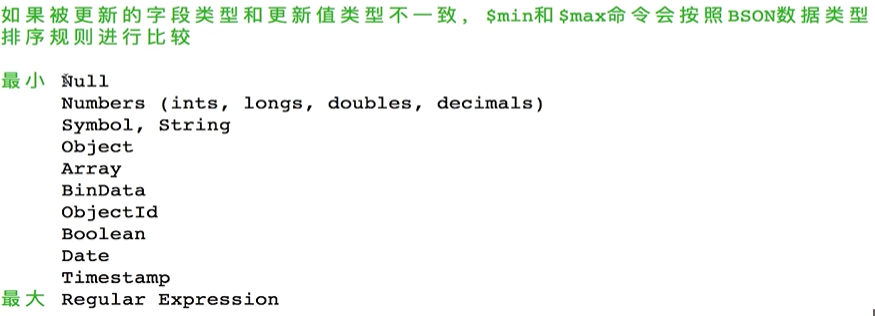

## 数组更新操作符

### $addToSet 像数组中增添元素

    {$addToSet: {<field1>: <value1>, .....}}

向数组字段中添加元素

查看karen的银行账户文档

    db.accounts.find(
        {name: "karen"},
        {name: 1, contact: 1, _id: 0}
    ).pretty()
    
向karen的账户文档中添加联系方式

    db.accounts.update(
        {name: "karen"},
        {$addToSet: {contact: "China"}}
    ).pretty()
    
    返回报错
        China已经存在
    
如果要插入的值已经存在数组字段中,则$addToSet不会在添加重复值

注意一下,使用$addToSet插入数组和文档时,插入值中的字段顺序也和已有值重复的时候,才被算作重复值被忽略

向karen的账户文档中添加新的联系方式

    db.accounts.update(
        {name: "karen"},
        {$addToSet: {
            contact: {
                "primaryEmail": "xxx@gmail.com",
                "secondaryEmail": "yyy@gmail.com",
            }
        }}
    )
    
    返回数据,发现可以插入数据,证明只有完完全全相同数据才会被$addToSet拒绝插入
    
        {
            "name" : "karen",
            "contact" : [
                [
                    "22222222",
                    "3333333"
                ],
                "Beijing",
                "China",
                {
                    "secondaryEmail" : "yyy@gmail.com",
                    "primaryEmail" : "xxx@gmail.com"
                },
                {
                    "primaryEmail" : "xxx@gmail.com",
                    "secondaryEmail" : "yyy@gmail.com"
                }
            ]
        }

向karen的账户文档中添加多个联系方式

    db.accounts.update(
        {name: "karen"},
        {$addToSet: {
            contact: [
                "contact1", "contact2"
            ]
        }}
    )
    
    返回数据,出现内嵌数组方式插入
    
        {
            "name" : "karen",
            "contact" : [
                [
                    "22222222",
                    "3333333"
                ],
                "Beijing",
                "China",
                {
                    "secondaryEmail" : "yyy@gmail.com",
                    "primaryEmail" : "xxx@gmail.com"
                },
                {
                    "primaryEmail" : "xxx@gmail.com",
                    "secondaryEmail" : "yyy@gmail.com"
                },
                [
                    "contact1",
                    "contact2"
                ]
            ]
        }
    
    $addToSet会将数组插入被更新的数组字段中,成为内嵌数组
    如果想要将多个元素直接添加到数组字段中,则需要使用$each操作符
    
向karen的账户文档中添加多个联系方式(非内嵌数组文档方式)

    db.accounts.update(
        {name: "karen"},
        {$addToSet: {
            contact: { 
                $each: ["contact1", "contact2"]
             }
        }}
    )
    
    返回数据
        {
            "name" : "karen",
            "contact" : [
                [
                    "22222222",
                    "3333333"
                ],
                "Beijing",
                "China",
                {
                    "secondaryEmail" : "yyy@gmail.com",
                    "primaryEmail" : "xxx@gmail.com"
                },
                {
                    "primaryEmail" : "xxx@gmail.com",
                    "secondaryEmail" : "yyy@gmail.com"
                },
                [
                    "contact1",
                    "contact2"
                ],
                "contact1",
                "contact2"
            ]
        }
    
### $pop 从数组中移除元素

    {$pop: {<field>: <-1 | 1>, ....}}

从数组字段中删除元素

从karen的账户文档中删除最后一个联系方式

    db.accounts.update(
        {name: "karen"},
        {$pop: {contact: 1}}
    )
    
    返回数据,删除了数组中最后元素
        {
            "name" : "karen",
            "contact" : [
                [
                    "22222222",
                    "3333333"
                ],
                "Beijing",
                "China",
                {
                    "secondaryEmail" : "yyy@gmail.com",
                    "primaryEmail" : "xxx@gmail.com"
                },
                {
                    "primaryEmail" : "xxx@gmail.com",
                    "secondaryEmail" : "yyy@gmail.com"
                },
                [
                    "contact1",
                    "contact2"
                ],
                "contact1"
            ]
        }
    
从karen的账户文档中删除内嵌数组的联系方式 "contact.5"

    db.accounts.update(
        {name: "karen"},
        {$pop: { "contact.5": -1}}
    )
    
    返回数据
        {
            "name" : "karen",
            "contact" : [
                [
                    "22222222",
                    "3333333"
                ],
                "Beijing",
                "China",
                {
                    "secondaryEmail" : "yyy@gmail.com",
                    "primaryEmail" : "xxx@gmail.com"
                },
                {
                    "primaryEmail" : "xxx@gmail.com",
                    "secondaryEmail" : "yyy@gmail.com"
                },
                [
                    "contact2"
                ],
                "contact1"
            ]
        }
    
    删除数组中最后一个元素后,会留下空数组
    
    注意一点,$pop操作符只能应用在数组字段上

### $pull 从数组中有选择性地移除元素

    {$pull: {<field: <value|condition>, ....}}

从数组字段中删除特定的元素

为了演示方便,首先将karen的账户文档复制成为一篇新的文档,并且吧新文档的用户姓名设置为lawrence

    db.accounts.find(
        {name: "karen"},
        {_id: 0}
    ).forEach( function(doc){
        var newDoc = doc;
        newDoc.name = "lawrence";
        db.accounts.insert(newDoc);
    })
    
    查看文档
    
    db.accounts.find(
             {name: "lawrence"},
              {name: 1, contact: 1, _id: 0}
          ).pretty()
          
从karen的联系方式中删除包含hi字母的元素

事实上,既然$pull操作符本身只能作用在数组元素上,我们便不需要在额外用 $elemMatch 操作符了

可以将$pull操作符处理的数组元素当做普通的顶层字段来应用筛选条件

    db.accounts.update(
        {name: "karen"},
        {$pull: { "contact": {$regex: /hi/}}}
    )
    
当然,如果数组元素本身就是一个内嵌数组,我们也可以使用$elemMatch来堆这个内嵌数组进行删除

    db.accounts.update(
        {name: "karen"},
        {$pull: { "contact": {$elemMatch: {$eq: "22222222"}}}}
    )
    
    返回,删除了整个内嵌数组元素
        {
            "name" : "karen",
            "contact" : [
                "Beijing",
                {
                    "secondaryEmail" : "yyy@gmail.com",
                    "primaryEmail" : "xxx@gmail.com"
                },
                {
                    "primaryEmail" : "xxx@gmail.com",
                    "secondaryEmail" : "yyy@gmail.com"
                },
                [
                    "contact2"
                ],
                "contact1"
            ]
        }

### $pullAll 从数组中有选择性地移除元素

    {$pullAll: {<field>: [<value1>, <value2>, ....]}}
    
从数组字段中删除特定元素

    {$pullAll: {<field>: [<value1>, <value2>, ....]}}

相当于

    {$pull: {<field>: {$in: [<value1>, <value2>, ....]}}}
    
如果要删除的元素是一个数组,数组元素的值和排列都必须和被删除的数组完全一样.

如果要删除的元素是内嵌文档

    $pop命令只需要匹配一个就能删除内嵌文档
    $pullAll命令必须完全匹配,顺序也需要相同才能删除

### $push 向数组中添加元素

    {$push: {<field>: <value1>, ....}}
    
$push和$addToset命令相似,但是$push命令的功能更强大

和$addToSet命令一样,如果$push命令中指定的数组字段不存在,这个字段会被添加到原文档中

    db.accounts.update(
        {name: "lawrence"},
        {$push: {newArray: "new element"}}
    )
    
    返回数据 
        {
            "name" : "lawrence",
            "contact" : [
                [
                    "22222222",
                    "3333333"
                ],
                "Beijing",
                "China",
                {
                    "secondaryEmail" : "yyy@gmail.com",
                    "primaryEmail" : "xxx@gmail.com"
                },
                {
                    "primaryEmail" : "xxx@gmail.com",
                    "secondaryEmail" : "yyy@gmail.com"
                },
                [
                    "contact2"
                ],
                "contact1"
            ],
            "newArray" : [
                "new element",
                "new element",
                "new element",
                "new element"
            ]
        }
        
和$addToSet命令一样, $push操作符也可以和$each搭配使用,给内嵌数组添加元素而不是插入一个内嵌数组

    db.accounts.update(
        {name: "lawrence"},
        {$push: {newArray: {
            $each: [2,3,4]
        }}}
    )
    
    返回数据
    
        {
            "name" : "lawrence",
            "contact" : [
                [
                    "22222222",
                    "3333333"
                ],
                "Beijing",
                "China",
                {
                    "secondaryEmail" : "yyy@gmail.com",
                    "primaryEmail" : "xxx@gmail.com"
                },
                {
                    "primaryEmail" : "xxx@gmail.com",
                    "secondaryEmail" : "yyy@gmail.com"
                },
                [
                    "contact2"
                ],
                "contact1"
            ],
            "newArray" : [
                "new element",
                "new element",
                "new element",
                "new element",
                2,
                3,
                4
            ]
        }

### 使用$position操作符将元素插入到数组的指定位置

    db.accounts.update(
        {name: "lawrence"},
        {$push: {newArray: {
            $each: ["pos1"],
            $position: 0
        }}}
    )
    
    返回
        "newArray" : [
            "pos1",
            2,
            3,
            4,
            "new element",
        ]
    
    那么插入最后就是 $position: -1
    
### 使用$sort操作符对数组进行排序

    db.accounts.update(
        {name: "lawrence"},
        {$push: {newArray: {
            $each: ["sort1"],
            $sort: 1
        }}}
    )
    
    返回数据
        "newArray" : [
            2,
            2,
            3,
            3,
            4,
            4,
            "new element",
            "new element",
            "new element",
            "new element",
            "pos1",
            "pos1",
            "sort1"
        ]
        
    注意这里的$sort必须配合$push和$each操作符
    
如果插入的元素是内嵌文档,也可以根据内嵌文档的字段值排序

    db.accounts.update(
        {name: "lawrence"},
        {$push: {newArray: {
            $each: [{key: "sort", value: 100}, {key: "sort", value: 200}],
            $sort: {value: -1}
        }}}
    )
    
    返回数据
        "newArray" : [
            {
                "key" : "sort",
                "value" : 200
            },
            {
                "key" : "sort",
                "value" : 100
            },
            2,
            2,
            3,
            3,
            4,
            4,
            "new element",
            "new element",
            "new element",
            "new element",
            "pos1",
            "pos1",
            "sort1"
        ]
        
如果不想插入元素,只想对文档中数组字段进行排序

    db.accounts.update(
        {name: "lawrence"},
        {$push: {newArray: {
            $each: [],
            $sort: 1
        }}}
    )
    
    返回数据
    
        "newArray" : [
            2,
            2,
            3,
            3,
            4,
            4,
            "new element",
            "new element",
            "new element",
            "new element",
            "pos1",
            "pos1",
            "sort1",
            {
                "key" : "sort",
                "value" : 100
            },
            {
                "key" : "sort",
                "value" : 200
            }
        ]
        
使用$slice来截取部分数组

    db.accounts.update(
        {name: "lawrence"},
        {$push: {newArray: {
            $each: ["slice1"],
            $slice: -8
        }}}
    )
    
    返回数据
    
        "newArray" : [
            "new element",
            "new element",
            "pos1",
            "pos1",
            "sort1",
            {
                "key" : "sort",
                "value" : 100
            },
            {
                "key" : "sort",
                "value" : 200
            },
            "slice1"
        ]

    或者不插入直接截取
        db.accounts.update(
            {name: "lawrence"},
            {$push: {newArray: {
                $each: [],
                $slice: 6
            }}}
        )

这三个操作符的执行顺序是
    
    $position
    $sort
    $slice
    
写在命令中的操作符顺序并不重要,并不会影响命令的执行顺序
    
        db.accounts.update(
            {name: "lawrence"},
            {$push: {newArray: {
                $each: ["push1", "push2"],
                $position: 2,
                $sort: 1,
                $slice: 6
            }}}
        )
        
        返回数据
            "newArray" : [
                "new element",
                "new element",
                "pos1",
                "pos1",
                "push1",
                "push2"
            ]

## $站位操作符

    db.collection.update(
        {<array>: <query selector>},
        {<update operator>: {"<array>.$": value}}
    )
    
更新数组中的特定元素

$是数组中第一符合筛选条件的数组元素的占位符,搭配更新操作符使用,可以堆满足筛选条件的数组元素进行更新

    db.accounts.update(
        {name: "lawrence", newArray: "pos1"},
        {$set: {
            "newArray.$": "updated"
        }}
    )
    
    返回数据
        "newArray" : [
            "new element",
            "new element",
            "updated",
            "pos1",
            "push1",
            "push2"
        ]
    
更新数组中的所有元素

    db.accounts.update(
        {name: "lawrence"},
        {$set: {
            "contact.0.$[]": "88888888"
        }}
    )
    
    返回数据
    
		[
			"88888888",
			"88888888"
		],

## 更新文档的options

options 文档提供了update命令的更多选项

### multi

```{multi: <boolean>}```

更新多个文档,到目前为止,我们在update命令中使用的筛选条件只对应于一篇文档

在默认情况下,即使筛选条件对应了多篇文档, update命令仍然只会更新一篇文档

    db.accounts.update(
        {},
        {$set: {
            "currency": "USD"
        }},
        {multi: true}
    )
    
注意:

    mongodb只能保证单个文档操作的原子性,不能保证多个文档操作的原子性
    更新多个文档操作虽然在单一线程中执行,但是线程在执行过程可能被挂起,以便其他线程也有机会堆数据进行操作
    如果需要保证多个文档操作是的原子性,就需要使用mongodb4.0版本引入的事务功能进行操作
    有关事务功能的讲解,大家可以参考mongodb4.0新特性课程
    
### upsert

在默认情况下,如果update命令中的筛选条件没有匹配任何文档,则不会进行任何操作

将upsert选项设置为true,如果update命令中的筛选条件没有匹配任何文档,则会创建新的文档

    db.accounts.update(
        {name: "maggie"},
        {$set: {balance: 700}},
        {upsert: true}
    )
    
    返回内容,没有匹配数据,但是更新了数据
    
        WriteResult({
            "nMatched" : 0,
            "nUpserted" : 1,
            "nModified" : 0,
            "_id" : ObjectId("5d4efa696d1ce6b351a57824")
        })

    文档内容
    
        { "_id" : ObjectId("5d4efa696d1ce6b351a57824"), "name" : "maggie", "balance" : 700 }
        
不过,如果无法从筛选条件中推断出确定的字段值,新创建的文档将不会包含筛选条件涉及的字段

    db.accounts.update(
        {balance: {$gt: 20000000}},
        {$set: {name: "nick"}},
        {upsert: true}
    )
    
    返回数据
    
        { "_id" : ObjectId("5d4efb806d1ce6b351a57839"), "name" : "nick" }
        
发现这次没有给我们创建新的balance字段,因为mongo无法确认balance的值.

另一个可以用来更新文档的命令

```db.<collection>.save(<document>)```

如果document文档中包含了_id字段,save()命令将会调用db.collection.update()命令(upsert:true)

    db.accounts.save({_id: ObjectId("5d4e597430f668d9f5f89bd2"), name: "jack", balance: 100})
    
包含一个不存在的_id

    db.accounts.save({_id: "fdfdsada", name: "jack", balance: 100})
    
我们来看一下数据

    { "_id" : ObjectId("5d4e597430f668d9f5f89bd2"), "name" : "jack", "balance" : 100 }
    { "_id" : ObjectId("5d4e597430f668d9f5f89bd3"), "name" : "karen", "balance" : 2500 }
    { "_id" : ObjectId("5d4e698030f668d9f5f89bd4"), "name" : "lawrence", "balance" : 2500 }
    { "_id" : ObjectId("5d4efa696d1ce6b351a57824"), "name" : "maggie", "balance" : 700 }
    { "_id" : ObjectId("5d4efb806d1ce6b351a57839"), "name" : "nick" }
    { "_id" : ObjectId("5d4eff25735b9926d6c95922"), "name" : "jack", "balance" : 100 }
    { "_id" : "fdfdsada", "name" : "jack", "balance" : 100 }
    
## 删除文档

    删除集合
    删除特定文档
    db.collection.remove()
    
```db.<collection>.remove(<query>, <options>)```

```<query>```文档定义了删除操作是筛选文档的条件

```<options>```文档定义了删除操作的参数

删除余额为50的银行账户文档

    db.accounts.remove({balance: 50})
    
在默认情况下,remove命令会删除所有符合筛选条件的文档

如果只想删除满足筛选条件的第一篇文档,可以使用justOne选项

删除一篇余额小于100的银行账户文档

    db.accounts..remove(
        {balance: {$lt: 100}}, 
        {justOne: true}
    )
    
删除集合内所有的文档

    db.accounts.remove({})

## 删除集合

    db.accounts.drop()
    
    db.<collection>.drop({wirteConcern: <document>})
    
这里的wirteConcern文档定义了本次集合删除操作的安全写级别

drop命令可以删除整个集合.包括集合中的所有文档,以及集合的索引

    db.accounts.drop()
    
    show collections
    
如果集合中文档数量很多,使用remove命令删除所有文档的效率不高

这种情况下,更加有效率的方法,是使用drop命令删除集合,然后在创建集合并创建索引
    
# 第4章 MongoDB基本操作进阶之聚合

聚合操作是指: 将一系列不同的操作按照一定顺序应用到数据库的文档中

数据库有4篇文档要知道多少篇文档 count


文档属于哪些客户distinct


文档属于alice文档中余额总和


    单一用途的聚合方法
    Map Reduce
    聚合管道 db.collection.aggregate()
    
聚合表达式

    用来操作输入文档的"公式"
    经聚合表达式计算出的值可以被赋予输出文档中的字段
    字段路径,系统变量,文本,表达式对象,操作符
    
聚合阶段

    聚合阶段有顺序的排列在聚合管道中
    绝大多数聚合阶段反复出现($out和$geoNear除外)
    数据库层面和集合层面
    
聚合操作符

    用来构建聚合表达式
    {<operator>:[<argument1>, <argument2> ....]}
    {<operator>:<argument1>}
 
## 最常用的聚合管道

    语法: db.<collection>.aggregate(<pipleline>, <options>)
    <pipleline>文档定义了操作中使用的聚合管道阶段和聚合操作符
    <options>文档声明了一些聚合操作的参数
    
聚合表达式

### 字段路径表达式

    $<field>-使用$来指示字段路径
    $<field>.<sub-field>-使用$和.来指示内嵌文档字段路劲
    $name -指示银行文档中客户姓名的字段
    $info.dateOpened-指示银行账户文档中开户日期的字段
    
### 系统变量表达式

    $$<variable>-使用$$来指示系统变量
    $$CURRENT-指示管道中当前操作的文档
        - $$CURRENT.<field>和$<field>等等效的
        
### 常量表达式
    $literal: <vlaue> - 指示常量<value>
    $literal: "$name" - 指示常量字符串 "$name"
                      - 这里的$被当做常量处理,而不是字段路劲表达式
                          
### 聚合管道阶段

$project - 对输入文档进行再次投影

    先创建几个文档
    db.accounts.insertMany([
        {
            name: {firstName: "alice", lastName: "wong"},
            balance: 50
        },
        {
            name: {firstName: "bob", lastName: "yang"},
            balance: 20
        }
    ])
    
    对银行账户文档进行重新投影
        db.accounts.aggregate({
            $project: {
                _id: 0,
                balance: 1,
                clientName: "$name.firstName"
            }
        })
    
    返回数据
    
        { "balance" : 50, "clientName" : "alice" }
        { "balance" : 20, "clientName" : "bob" }
        
    如果对于一个没有字段会出现什么情况
        db.accounts.aggregate({
            $project: {
                _id: 0,
                balance: 1,
                nameArray: ["$name.firstName", "$name.middleName", "$name.lastName"]
            }
        })

    返回数据,发现没有字段直接返回null
        { "balance" : 50, "nameArray" : [ "alice", null, "wong" ] }
        { "balance" : 20, "nameArray" : [ "bob", null, "yang" ] }

    $project 是一个非常常用的聚合阶段
    可以用来灵活的控制输出文档的格式
    也可以用来剔除不相关的字段,以优化聚合管道操作的性能

$match - 对输入文档进行筛选

    $match中使用的文档筛选语法,和读取文档时的筛选语法相同
    
    对银行文档进行筛选
        db.accounts.aggregate({
            $match: {
                "name.firstName": "alice"
            }
        })
        
    返回数据
        { "_id" : ObjectId("5d499767e5333f1dd6de923e"), "name" : { "firstName" : "alice", "lastName" : "wong" }, "balance" : 50 }

    更加复杂筛选
        db.accounts.aggregate({
            $match: {
                $or:[
                    {balance: {$gt: 40, $lt: 80}},
                    {"name.lastName": "yang"}
                ]
            }
        })
    
    返回数据
        { "_id" : ObjectId("5d499767e5333f1dd6de923e"), "name" : { "firstName" : "alice", "lastName" : "wong" }, "balance" : 50 }
        { "_id" : ObjectId("5d499767e5333f1dd6de923f"), "name" : { "firstName" : "bob", "lastName" : "yang" }, "balance" : 20 }

    将筛选和投影阶段结合在一起
        db.accounts.aggregate([{
            $match: {
                $or:[
                    {balance: {$gt: 40, $lt: 80}},
                    {"name.lastName": "yang"}
                ]
            }
        },{
            $project: {
            _id: 0
            }
        }])
        
    返回数据
        { "name" : { "firstName" : "alice", "lastName" : "wong" }, "balance" : 50 }
        { "name" : { "firstName" : "bob", "lastName" : "yang" }, "balance" : 20 }
        
    $match也是一个很常用的聚合阶段
    应该尽量在聚合管道的开始阶段应用$match
    应该可以减少后续阶段中需要处理的文档数量,优化聚合操作的性能

$limit - 筛选管道内前N篇文档
    
    筛选出第一篇银行账户文档
        db.accounts.aggregate([
            {$limit: 1}
        ])
     
    返回第一篇文档
        { "_id" : ObjectId("5d499767e5333f1dd6de923e"), "name" : { "firstName" : "alice", "lastName" : "wong" }, "balance" : 50 }

$skip - 跳过管道内前N篇文档

    跳过第一篇银行账户文档
        db.accounts.aggregate([
            {$skip: 1}
        ])
    
    返回第二篇文档开始的所有文档
    

$unwind - 展开输入文档中的数组字段

    向现有的银行账户文档中加入数组字段
        db.accounts.update(
            {"name.firstName": "alice"},
            {$set: {currency: ["CNY", "USD"]}}
        )
        
        db.accounts.update(
            {"name.firstName": "bob"},
            {$set: {currency: "GBP"}}
        )
     
    数组展开
        db.accounts.aggregate([
            {$unwind: {
                path: "$currency"
            }}
        ])
        
    返回
        { "_id" : ObjectId("5d499767e5333f1dd6de923e"), "name" : { "firstName" : "alice", "lastName" : "wong" }, "balance" : 50, "currency" : "CNY" }
        { "_id" : ObjectId("5d499767e5333f1dd6de923e"), "name" : { "firstName" : "alice", "lastName" : "wong" }, "balance" : 50, "currency" : "USD" }
        { "_id" : ObjectId("5d499767e5333f1dd6de923f"), "name" : { "firstName" : "bob", "lastName" : "yang" }, "balance" : 20, "currency" : "GBP" }

    数组展开数组是添加原数组元素的位置
        db.accounts.aggregate([
            {$unwind: {
                path: "$currency",
                includeArrayIndex: "ccyIndex"
            }}
        ])
    
    返回
        { "_id" : ObjectId("5d499767e5333f1dd6de923e"), "name" : { "firstName" : "alice", "lastName" : "wong" }, "balance" : 50, "currency" : "CNY", "ccyIndex" : NumberLong(0) }
        { "_id" : ObjectId("5d499767e5333f1dd6de923e"), "name" : { "firstName" : "alice", "lastName" : "wong" }, "balance" : 50, "currency" : "USD", "ccyIndex" : NumberLong(1) }
        { "_id" : ObjectId("5d499767e5333f1dd6de923f"), "name" : { "firstName" : "bob", "lastName" : "yang" }, "balance" : 20, "currency" : "GBP", "ccyIndex" : null }

    在添加几个文档
        db.accounts.insertMany([
            {
                name: {firstName: "charlie", lastName: "gordon"},
                balance: 100
            },
            {
                name: {firstName: "david", lastName: "wu"},
                balance: 20,
                currency: []
            },
            {
                name: {firstName: "eddie", lastName: "kim"},
                balance: 20,
                currency: null
            }
        ]) 
    
    数组展开后
        db.accounts.aggregate([
            {$unwind: {
                path: "$currency"
            }}
        ])
    
    返回数据,还是3篇文档,$unwind会自动过滤掉null,空值,没有字段的
        { "_id" : ObjectId("5d499767e5333f1dd6de923e"), "name" : { "firstName" : "alice", "lastName" : "wong" }, "balance" : 50, "currency" : "CNY", "ccyIndex" : NumberLong(0) }
        { "_id" : ObjectId("5d499767e5333f1dd6de923e"), "name" : { "firstName" : "alice", "lastName" : "wong" }, "balance" : 50, "currency" : "USD", "ccyIndex" : NumberLong(1) }
        { "_id" : ObjectId("5d499767e5333f1dd6de923f"), "name" : { "firstName" : "bob", "lastName" : "yang" }, "balance" : 20, "currency" : "GBP", "ccyIndex" : null }

    展开数据是保留数组或不存在的数组的文档
        db.accounts.aggregate([
            {$sort: {
                path: "$currency",
                preseveNullAndEmptyArrays: true
            }}
        ])

    
$sort - 对输入文档进行排序

    对银行账户文档进行排序

        db.accounts.aggregate([
            {$unwind: {
                balance: 1,
                "name.lastName": -1
            }}
        ])
        
        返回数据,余额从小到大排序,如果余额相等姓名从大到小排序

## Lookup阶段     

$lookup - 对输入文档进行查询操作
    
使用单一字段值进行查询

语法:

    $lookup:{
        from: <collection to join>,
        localField: <field from the input docments>,
        foreignField; <field from the document of the "from" collection>,
        as: <output array field>
    }
    
    from同一数据库中的另一个查询集合
    localField管道文档中用来进行查询字段
    foreignField查询集合中的查询字段
    as写入管道文档中的查询结果数组字段
    
    增加一个集合用来存储外汇数据
    
        db.forex.insertMany(
          [
            {
                ccy: "USD",
                rate: 6.91,
                date: new Date("2018-12-21")
            },
            {
                ccy: "GBP",
                rate: 8.72,
                date: new Date("2018-10-21")
            },
            {
                ccy: "CNY",
                rate: 1.0,
                date: new Date("2018-12-21")
            }
          ]
        )
    
    将查询到的外汇汇率写入银行账户文档
    
        db.accounts.aggregate([
            {
                $lookup: {
                    from: "forex",
                    localField: "currency",
                    foreignField: "ccy",
                    as: "forexData"
                }
            }
        ])
        
    返回数据,如果匹配值加入文档,不匹配为空
        { "_id" : ObjectId("5d499767e5333f1dd6de923e"), "name" : { "firstName" : "alice", "lastName" : "wong" }, "balance" : 50, "currency" : [ "CNY", "USD" ], "forexData" : [ { "_id" : ObjectId("5d49bd1353318605b8ea38f9"), "ccy" : "USD", "rate" : 6.91, "date" : ISODate("2018-12-21T00:00:00Z") }, { "_id" : ObjectId("5d49bd1353318605b8ea38fb"), "ccy" : "CNY", "rate" : 1, "date" : ISODate("2018-12-21T00:00:00Z") } ] }
        { "_id" : ObjectId("5d499767e5333f1dd6de923f"), "name" : { "firstName" : "bob", "lastName" : "yang" }, "balance" : 20, "currency" : "GBP", "forexData" : [ { "_id" : ObjectId("5d49bd1353318605b8ea38fa"), "ccy" : "GBP", "rate" : 8.72, "date" : ISODate("2018-10-21T00:00:00Z") } ] }
        { "_id" : ObjectId("5d49b83353318605b8ea38f6"), "name" : { "firstName" : "charlie", "lastName" : "gordon" }, "balance" : 100, "forexData" : [ ] }
        { "_id" : ObjectId("5d49b83353318605b8ea38f7"), "name" : { "firstName" : "david", "lastName" : "wu" }, "balance" : 20, "currency" : [ ], "forexData" : [ ] }
        { "_id" : ObjectId("5d49b83353318605b8ea38f8"), "name" : { "firstName" : "eddie", "lastName" : "kim" }, "balance" : 20, "currency" : null, "forexData" : [ ] }

    如果localField是一个数组字段
    
        db.accounts.aggregate([
            {
                $unwind: {
                    path: "$currency",
                }
            },
            {
                $lookup: {
                    from: "forex",
                    localField: "currency",
                    foreignField: "ccy",
                    as: "forexData"
                }
            }
        ])
     
    返回数据,只有3篇文档,原因是$unwind字段展开后会过滤空值字段,在操作$lookup
        { "_id" : ObjectId("5d499767e5333f1dd6de923e"), "name" : { "firstName" : "alice", "lastName" : "wong" }, "balance" : 50, "currency" : "CNY", "forexData" : [ { "_id" : ObjectId("5d49bd1353318605b8ea38fb"), "ccy" : "CNY", "rate" : 1, "date" : ISODate("2018-12-21T00:00:00Z") } ] }
        { "_id" : ObjectId("5d499767e5333f1dd6de923e"), "name" : { "firstName" : "alice", "lastName" : "wong" }, "balance" : 50, "currency" : "USD", "forexData" : [ { "_id" : ObjectId("5d49bd1353318605b8ea38f9"), "ccy" : "USD", "rate" : 6.91, "date" : ISODate("2018-12-21T00:00:00Z") } ] }
        { "_id" : ObjectId("5d499767e5333f1dd6de923f"), "name" : { "firstName" : "bob", "lastName" : "yang" }, "balance" : 20, "currency" : "GBP", "forexData" : [ { "_id" : ObjectId("5d49bd1353318605b8ea38fa"), "ccy" : "GBP", "rate" : 8.72, "date" : ISODate("2018-10-21T00:00:00Z") } ] }
    
使用复杂条件进行查询

    $lookup:{
        from: <collection to join>,
        let: {<var_1>: <expression>, ..., <var_n>: <expression>},
        pipeline: [<pipeline to execute onthe collection to join>],
        as: <output array field>
    }
    
    pipeline 对查询集合中的文档使用聚合阶段进行处理
    let 对查询集合中的文档使用聚合阶段进行处理时,如果需要仓库管道文档中的字段,则必须使用let参数对字段进行声明
    
    将特定日期外汇汇率写入银行账户文档
        db.accounts.aggregate([
            {
                $lookup: {
                    from: "forex",
                    pipeline: [
                        {$match: {
                            date: new Date("2018-12-21")
                        }}
                    ],
                    as: "forexData"
                }
            }
        ])
        
    返回数据
        { "_id" : ObjectId("5d499767e5333f1dd6de923e"), "name" : { "firstName" : "alice", "lastName" : "wong" }, "balance" : 50, "currency" : [ "CNY", "USD" ], "forexData" : [ { "_id" : ObjectId("5d49bd1353318605b8ea38f9"), "ccy" : "USD", "rate" : 6.91, "date" : ISODate("2018-12-21T00:00:00Z") }, { "_id" : ObjectId("5d49bd1353318605b8ea38fb"), "ccy" : "CNY", "rate" : 1, "date" : ISODate("2018-12-21T00:00:00Z") } ] }
        { "_id" : ObjectId("5d499767e5333f1dd6de923f"), "name" : { "firstName" : "bob", "lastName" : "yang" }, "balance" : 20, "currency" : "GBP", "forexData" : [ { "_id" : ObjectId("5d49bd1353318605b8ea38f9"), "ccy" : "USD", "rate" : 6.91, "date" : ISODate("2018-12-21T00:00:00Z") }, { "_id" : ObjectId("5d49bd1353318605b8ea38fb"), "ccy" : "CNY", "rate" : 1, "date" : ISODate("2018-12-21T00:00:00Z") } ] }
        { "_id" : ObjectId("5d49b83353318605b8ea38f6"), "name" : { "firstName" : "charlie", "lastName" : "gordon" }, "balance" : 100, "forexData" : [ { "_id" : ObjectId("5d49bd1353318605b8ea38f9"), "ccy" : "USD", "rate" : 6.91, "date" : ISODate("2018-12-21T00:00:00Z") }, { "_id" : ObjectId("5d49bd1353318605b8ea38fb"), "ccy" : "CNY", "rate" : 1, "date" : ISODate("2018-12-21T00:00:00Z") } ] }
        { "_id" : ObjectId("5d49b83353318605b8ea38f7"), "name" : { "firstName" : "david", "lastName" : "wu" }, "balance" : 20, "currency" : [ ], "forexData" : [ { "_id" : ObjectId("5d49bd1353318605b8ea38f9"), "ccy" : "USD", "rate" : 6.91, "date" : ISODate("2018-12-21T00:00:00Z") }, { "_id" : ObjectId("5d49bd1353318605b8ea38fb"), "ccy" : "CNY", "rate" : 1, "date" : ISODate("2018-12-21T00:00:00Z") } ] }
        { "_id" : ObjectId("5d49b83353318605b8ea38f8"), "name" : { "firstName" : "eddie", "lastName" : "kim" }, "balance" : 20, "currency" : null, "forexData" : [ { "_id" : ObjectId("5d49bd1353318605b8ea38f9"), "ccy" : "USD", "rate" : 6.91, "date" : ISODate("2018-12-21T00:00:00Z") }, { "_id" : ObjectId("5d49bd1353318605b8ea38fb"), "ccy" : "CNY", "rate" : 1, "date" : ISODate("2018-12-21T00:00:00Z") } ] }
    
    注意,在这个例子中,查询条件和管道文档之间,其实并没有直接的联系,这种查询被称作不相关查询,$lookup从3.6版本开始支持不相关查询
    
    将特定日期外汇汇率写入余额大于100的银行账户文档
        db.accounts.aggregate([
            {
                $lookup: {
                    from: "forex",
                    let: {bal: "$balance"},
                    pipeline: [
                        {$match: {
                            $expr:{
                                $and: [
                                    {$eq: ["$date", new Date("2018-12-21")]},
                                    {$gt: ["$$bal", 99]},
                                ]
                            }
                        }}
                    ],
                    as: "forexData"
                }
            }
        ])
        
    $date指定的是查询集合forex的date子弹,accounts是管道集合,
    $$bal使用$$来指示系统变量let: {bal: "$balance"}管道集合,
    $expr可以使用let变量比较字段
        
    返回数据,余额大于99通过管道插入数据中
        { "_id" : ObjectId("5d499767e5333f1dd6de923e"), "name" : { "firstName" : "alice", "lastName" : "wong" }, "balance" : 50, "currency" : [ "CNY", "USD" ], "forexData" : [ ] }
        { "_id" : ObjectId("5d499767e5333f1dd6de923f"), "name" : { "firstName" : "bob", "lastName" : "yang" }, "balance" : 20, "currency" : "GBP", "forexData" : [ ] }
        { "_id" : ObjectId("5d49b83353318605b8ea38f6"), "name" : { "firstName" : "charlie", "lastName" : "gordon" }, "balance" : 100, "forexData" : [ { "_id" : ObjectId("5d49bd1353318605b8ea38f9"), "ccy" : "USD", "rate" : 6.91, "date" : ISODate("2018-12-21T00:00:00Z") }, { "_id" : ObjectId("5d49bd1353318605b8ea38fb"), "ccy" : "CNY", "rate" : 1, "date" : ISODate("2018-12-21T00:00:00Z") } ] }
        { "_id" : ObjectId("5d49b83353318605b8ea38f7"), "name" : { "firstName" : "david", "lastName" : "wu" }, "balance" : 20, "currency" : [ ], "forexData" : [ ] }
        { "_id" : ObjectId("5d49b83353318605b8ea38f8"), "name" : { "firstName" : "eddie", "lastName" : "kim" }, "balance" : 20, "currency" : null, "forexData" : [ ] }
    
## 会分类的聚合操作-Group阶段

$group - 对输入文档进行分组

    $group: {
        _id: <expression>,
        <field1>: {<accumulator1>: <expression1>},
        ....
    }
    
    _id定义分组规则
    field1可以使用聚合操作符来定义新字段

增加一个集合用来存储股票交易记录
    
    db.transactions.insertMany(
        [
            {
                symbol: "600519",
                qty: 100,
                price: 567.4,
                currency: "CNY"
             },
            {
                symbol: "AMZN",
                qty: 1,
                price: 1377.5,
                currency: "USD"
             },
            {
                symbol: "AAPL",
                qty: 2,
                price: 150.7,
                currency: "USD"
             },
        ]
    )
    
按照交易货币来分组交易记录

    db.transactions.aggregate({
        $group:{
            _id: "$currency"
        }
    })
    
    返回数据
    
        { "_id" : "USD" }
        { "_id" : "CNY" }
        
    不使用聚合操作符的情况下,$group可以返回管道文档中某一字段的所有(不重复的)值

使用聚合操作符计算分组聚合值

    db.transactions.aggregate({
        $group:{
            _id: "$currency",
            totalQty: {$sum: "$qty"},
            totalNotional: {$sum: {$multiply: ["$price", "$qty"]}},
            avgPrice: {$avg: "$price"},
            count: {$sum: 1},
            maxNotional: {$max: {$multiply: ["$price", "$qty"]}},
            maxNotional: {$min: {$multiply: ["$price", "$qty"]}},
        }
    })
    
    totalQty:交易总数量
    totalNotional:交易总价格
    avgPrice:交易平均价格
    count:交易笔数
    maxNotional:最大交易金额
    maxNotional:最小交易金额
    
    返回
    
        { "_id" : "USD", "totalQty" : 3, "totalNotional" : 1678.9, "avgPrice" : 764.1, "count" : 2, "maxNotional" : 301.4 }
        { "_id" : "CNY", "totalQty" : 100, "totalNotional" : 56740, "avgPrice" : 567.4, "count" : 1, "maxNotional" : 56740 }

使用聚合操作符计算所有的文档聚合值

    db.transactions.aggregate({
        $group:{
            _id: null,
            totalQty: {$sum: "$qty"},
            totalNotional: {$sum: {$multiply: ["$price", "$qty"]}},
            avgPrice: {$avg: "$price"},
            count: {$sum: 1},
            maxNotional: {$max: {$multiply: ["$price", "$qty"]}},
            maxNotional: {$min: {$multiply: ["$price", "$qty"]}},
        }
    })
    
    返回
        { "_id" : null, "totalQty" : 103, "totalNotional" : 58418.9, "avgPrice" : 698.5333333333333, "count" : 3, "maxNotional" : 301.4 }

使用聚合操作符创建数组字段

    db.transactions.aggregate({
        $group:{
            _id: "$currency",
            symbols: {$push: "$symbol"}
        }
    })
    
    $push将$symbol写入symbols字段
    
    返回
    
        { "_id" : "USD", "symbols" : [ "AMZN", "AAPL" ] }
        { "_id" : "CNY", "symbols" : [ "600519" ] }

## out阶段

$out - 将管道中文档输出

将聚合管道中的文档写入一个新的集合

    db.transactions.aggregate([
        {
            $group:{
                _id: "$currency",
                symbols: {$push: "$symbol"}
            }
        },
        {
            $out: "output"
        }
    ])
    
    查询
        db.output.find()
        
        { "_id" : "USD", "symbols" : [ "AMZN", "AAPL" ] }
        { "_id" : "CNY", "symbols" : [ "600519" ] }
        
将聚合管道中的文档吸入一个已存在的集合

    db.transactions.aggregate([
        {
            $group:{
                _id: "$symbol",
                totalNotional: {$sum: {$multiply: ["$price", "$qty"]}},
            }
        },
        {
            $out: "output"
        }
    ])
    
    返回数据
        
        { "_id" : "AAPL", "totalNotional" : 301.4 }
        { "_id" : "AMZN", "totalNotional" : 1377.5 }
        { "_id" : "600519", "totalNotional" : 56740 }

如果聚合管道操作遇到错误,管道阶段不会创建新的集合或是覆盖已存在的集合内容

## 聚合管道的优化与局限

    语法: db.<collection>.aggregate(<pipleline>, <options>)
    <pipleline>文档定义了操作中使用的聚合管道阶段和聚合操作符
    <options>文档声明了一些聚合操作的参数

options作用
    
    allowDiskUse: boolean
    每个聚合管道阶段使用的内存不能超过100MB
    如果数据量较大,为了防止聚合管道阶段超出内存上限并且抛出错误,可以启用allowDiskUse选项
    allowDiskUse启用之后,聚合阶段可以在内存容量不足时,将操作数据写入临时文件中
    临时文件会被写入dbpath下的_tmp文件夹,dbpath的默认值为/data/db
    
    db.transactions.aggregate([{
        $group:{
            _id: "$currency",
            symbols: {$push: "$symbol"}
        }
    }],
    {allowDiskUse: true}
    )
    
## 聚合操作的优化

### 聚合阶段顺序优化
    
$project + $match

    $match阶段会在$project阶段之前运行
    
        db.transactions.aggregate([
            {
                $project:{
                    _id: 0, symbol: 1, currency: 1,
                    notional: {$multiply: ["$price", "$qty"]}
                }
            },
            {
                $match: {
                    currency: "USD",
                    notional:{$gt: 100}
                }
            }
        ])
        
    我们定义了2个管道筛选条件,currency: "USD",和notional:{$gt: 100},但是mongo会优化成下面执行语句
    
        db.transactions.aggregate([
            {
                $match: {
                    currency: "USD"
                }
            },
            {
                $project:{
                    _id: 0, symbol: 1, currency: 1,
                    notional: {$multiply: ["$price", "$qty"]}
                }
            },
            {
                $match: {
                    notional:{$gt: 100}
                }
            }
        ])
        
    因为currency: "USD"筛选条件是原数据已经存在的先处理
    
$sort + $match
    
    $match阶段会在$sort阶段之前运行
        db.transactions.aggregate([
            {
                $match:{
                    currency: "USD"
                }
            },
            {
                $sort: {
                    price: 1
                }
            }
        ])
    
    mongo会优化成先执行$match,在执行$sort
    
$project + $skip
    
    $skip阶段会在$project阶段之前运行
    
        db.transactions.aggregate([
            {
                $project:{
                    _id: 0, symbol: 1, currency: 1,
                    notional: {$multiply: ["$price", "$qty"]}
                }
            },
            {
                $skip: 2
            }
        ])
        
    会执行成
    
        db.transactions.aggregate([
            {
                $skip: 2
            },
            {
                $project:{
                    _id: 0, symbol: 1, currency: 1,
                    notional: {$multiply: ["$price", "$qty"]}
                }
            }
        ])
        
### 聚合阶段合并优化
    
$sort + $limit

    如果两者之间没有夹杂着会改变文档数量的聚合阶段,$sort + $limit阶段可以合并
    
        db.transactions.aggregate([
            {
                $sort: {price: 1}
            },
            {
                $project:{
                    _id: 0, symbol: 1, currency: 1,
                    notional: {$multiply: ["$price", "$qty"]}
                }
            },
            {
                $limit: 2
            }
        ])
        
    mongo会执行成, $sort: {price: 1} + $limit: 2 这里是伪代码
    
        db.transactions.aggregate([
            {
                $sort: {price: 1} + $limit: 2 这里是伪代码
            },
            {
                $project:{
                    _id: 0, symbol: 1, currency: 1,
                    notional: {$multiply: ["$price", "$qty"]}
                }
            }
        ])
        
    $limit + $limit
    $skip + $skip
    $match + $match
    
连续的$limit,$skip,$match阶段排列在一起是,可以合并为一个阶段
    
    {$limit: 10}, ---> {$limit: 5}
    {$limit: 5}
    
    {$skip: 10}, ---> {$skip: 15}
    {$skip: 5}
    
    {$match: {currency: "USD"}} --->
    {$match: {qty: 1}}
    
    --> {$match: {
            $and: [
                {"currency": "USD"},
                {"qty": 1}
            ]
        }}
    
$lookup + $unwind

    连续排序在一起的$lookup和$unwind阶段,如果$unwind应用在$lookup阶段创建的as字段上,则两者可以合并

        db.accounts.aggregate([
            {
                $lookup: {
                    from: "forex",
                    localField: "currency",
                    foreignField: "ccy",
                    as: "forexData"
                }
            },
            {
                $unwind: "$forexData"
            }
        ])
        
    mongo会执行成,直接内部执行$unwind
    
        db.accounts.aggregate([
            {
                $lookup: {
                    from: "forex",
                    localField: "currency",
                    foreignField: "ccy",
                    as: "forexData"
                }
            } + {$unwind: "$forexData"} 伪代码
        ])

# 第5章 论MongoDB中索引的重要性

## 什么是索引

    index
    合适的索引可以大大提升数据库搜索性能
    集合层面的索引

单键索引

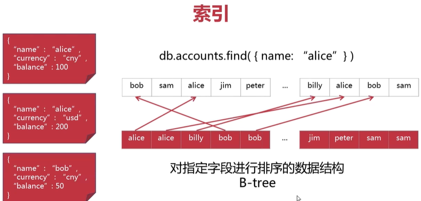

复合键索引

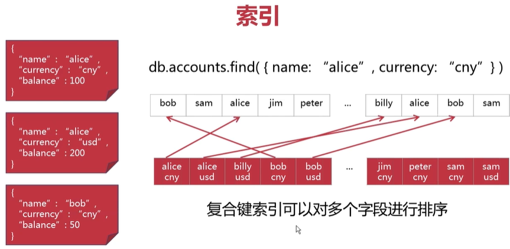

复合键索引注意点,发现只有a字段是排序好的,其他字段单独搜索时索引是不起效果的

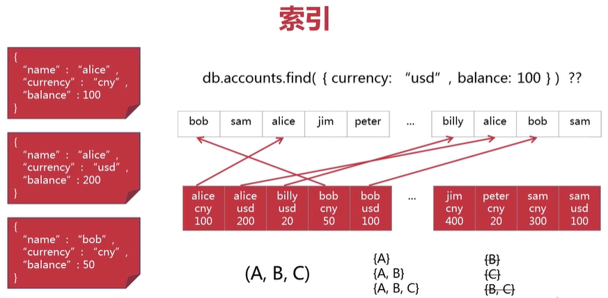

对文档部分内容进行排序的数据结构

加快文档查询和文档排序的速度

复合键索引只能支持前缀子查询

索引的操作

    db.collection.getIndexes()
    
    db.collection.createIndex()
    
    db.collection.dropIndex()

索引的类型

    单键索引
    
    复合键索引
    
    多键索引
    
索引的特效
    
    唯一性
    稀疏性
    生存时间
    
查询分析

    检视索引的效果
    explain()
    
索引的选择
    
    如何创建一个合适索引
    索引对数据库操作的影响
    
## 索引的操作,效果和特性

db.collection.createIndex(keys, options)

    keys 文档指定了创建索引的字段
    
创建一个新的集合

    db.accountsWithIndex.insertMany([
        {name: "alice", balance: 50, currency: ["GBP", "USD"]},
        {name: "bob", balance: 20, currency: ["AUD", "USD"]},
        {name: "bob", balance: 300, currency: ["CNY", "USD"]},
    ])
    
### 创建一个单键索引

    db.accountsWithIndex.createIndex({name: 1})
    
    1代表正向排序
    
返回数据

    {
        "createdCollectionAutomatically" : false,
        "numIndexesBefore" : 1,
        "numIndexesAfter" : 2,
        "ok" : 1
    }

列出集合中已存在的索引

    db.accountsWithIndex.getIndexes()
    
返回数据

    [
        {
            "v" : 2,
            "key" : {
                "_id" : 1
            },
            "name" : "_id_",
            "ns" : "test.accountsWithIndex"
        },
        {
            "v" : 2,
            "key" : {
                "name" : 1
            },
            "name" : "name_1",
            "ns" : "test.accountsWithIndex"
        }
    ]

### 创建一个复合键索引

    db.accountsWithIndex.createIndex({name: 1, balance: -1})
    
### 创建一个多键索引

用来创建在数组字段上

    db.accountsWithIndex.createIndex({currency: 1})
    
    多键索引,数组字段中的每一个元素,都会在多键索引中创建一个键
    
        "AUD" --> {"bob"}
        "CNY" --> {"bob"}
        "GBP" --> {"alice"}
        "USD" --> {"alice"}
        "USD" --> {"bob"}
        
### 索引的效果

    语法: db.collection.explain().<method(...)>
    
    可以使用explain()进行分析的命令包括aggregate(), count(), distinct(), find(), group(), remove(), update()
    
使用没有创建索引的字段进行搜索

    db.accountsWithIndex.explain().find({ balance: 100})
    
    返回数据
    
        {
            "queryPlanner" : {
                "plannerVersion" : 1,
                "namespace" : "test.accountsWithIndex",
                "indexFilterSet" : false,
                "parsedQuery" : {
                    "balance" : {
                        "$eq" : 100
                    }
                },
                "winningPlan" : {
                    "stage" : "COLLSCAN",
                    "filter" : {
                        "balance" : {
                            "$eq" : 100
                        }
                    },
                    "direction" : "forward"
                },
                "rejectedPlans" : [ ]
            },
            "serverInfo" : {
                "host" : "7d4b54dab2c2",
                "port" : 27017,
                "version" : "4.0.11",
                "gitVersion" : "417d1a712e9f040d54beca8e4943edce218e9a8c"
            },
            "ok" : 1
        }
        
    我们要关注的是winningPlan字段inputStage中,返回的是COLLSCAN全表扫描,不是非常好的方法.看到这个时候要警示!
    
使用已经创建索引的字段进行搜索

    db.accountsWithIndex.explain().find({ name: "alice"})

    返回数据
		"winningPlan" : {
			"stage" : "FETCH",
			"inputStage" : {
				"stage" : "IXSCAN",
				"keyPattern" : {
					"name" : 1,
					"balance" : -1
				},
				"indexName" : "name_1_balance_-1",
				"isMultiKey" : false,
				"multiKeyPaths" : {
					"name" : [ ],
					"balance" : [ ]
				},
				"isUnique" : false,
				"isSparse" : false,
				"isPartial" : false,
				"indexVersion" : 2,
				"direction" : "forward",
				"indexBounds" : {
					"name" : [
						"[\"alice\", \"alice\"]"
					],
					"balance" : [
						"[MaxKey, MinKey]"
					]
				}
			}
		},
		
    发现是显示为 IXSCAN,表示使用了索引扫描,用的是name_1_balance_-1复合键索引,从fetch中取数据
    
仅返回创建了索引的字段

    db.accountsWithIndex.explain().find({ name: "alice"}, {_id:0, name:1})
    
    返回数据
		"winningPlan" : {
			"stage" : "PROJECTION",
			"transformBy" : {
				"_id" : 0,
				"name" : 1
			},
			"inputStage" : {
				"stage" : "IXSCAN",
				"keyPattern" : {
					"name" : 1,
					"balance" : -1
				},
				"indexName" : "name_1_balance_-1",
				"isMultiKey" : false,
				"multiKeyPaths" : {
					"name" : [ ],
					"balance" : [ ]
				},
				"isUnique" : false,
				"isSparse" : false,
				"isPartial" : false,
				"indexVersion" : 2,
				"direction" : "forward",
				"indexBounds" : {
					"name" : [
						"[\"alice\", \"alice\"]"
					],
					"balance" : [
						"[MaxKey, MinKey]"
					]
				}
			}
		},
    
    发现没有从fetch中取数据,直接进行了PROJECTION投影操作,直接用索引的键值
    
使用已经创建索引的字段进行排序

    db.accountsWithIndex.explain().find().sort({name: 1, balance: -1})

    返回数据
    
		"winningPlan" : {
			"stage" : "FETCH",
			"inputStage" : {
				"stage" : "IXSCAN",
				"keyPattern" : {
					"name" : 1,
					"balance" : -1
				},
				"indexName" : "name_1_balance_-1",
				"isMultiKey" : false,
				"multiKeyPaths" : {
					"name" : [ ],
					"balance" : [ ]
				},
				"isUnique" : false,
				"isSparse" : false,
				"isPartial" : false,
				"indexVersion" : 2,
				"direction" : "forward",
				"indexBounds" : {
					"name" : [
						"[MinKey, MaxKey]"
					],
					"balance" : [
						"[MaxKey, MinKey]"
					]
				}
			}
		},
		
    发现IXSCAN,非常棒,应该我们已经定义了复合索引 db.accountsWithIndex.createIndex({name: 1, balance: -1}),查询速度非常快
    
使用微创建索引的字段进行排序

    db.accountsWithIndex.explain().find().sort({name: 1, balance: 1})

    返回数据
    
		"winningPlan" : {
			"stage" : "SORT",
			"sortPattern" : {
				"name" : 1,
				"balance" : 1
			},
			"inputStage" : {
				"stage" : "SORT_KEY_GENERATOR",
				"inputStage" : {
					"stage" : "COLLSCAN",
					"direction" : "forward"
				}
			}
		},

    发现winningPlan是SORT,这就提示了这次排序命令效率不够高
    
### 删除索引

    db.collection.dropIndex()
    
    如果需要更改某些字段上已经创建的索引
    必须首先删除原有的索引,再重新创建新索引,否则,新索引不会包含原有文档
    
使用索引名称删除索引
    
    列出索引
        db.accountsWithIndex.getIndexes()
        
    返回数据,这里name就是mongo创建的索引名称
        {
            "v" : 2,
            "key" : {
                "name" : 1
            },
            "name" : "name_1",
            "ns" : "test.accountsWithIndex"
        },
        
    删除一个单键索引
        db.accountsWithIndex.dropIndex("name_1")
        
使用索引定义删除索引

    db.accountsWithIndex.dropIndex({name: 1, balance: -1})
        
## 创建索引options

    db.collection.createIndex(keys, options)
    
    options文档定义了创建索引时可以使用的一些参数,文档也可以设定索引的特性
    
### 索引的唯一性-唯一索引

    文档主键上创建的默认索引
        {
            "v" : 2,
            "key" : {
                "_id" : 1
            },
            "name" : "_id_",
            "ns" : "test.accountsWithIndex"
        },
        
    这样一个文档主键索引,具有唯一性
    
创建一个具有唯一性的索引
    
    db.accountsWithIndex.createIndex({balance: 1}, {unique: true})
    
    查询索引
        db.accountsWithIndex.getIndexes()
        
    发现"unique" : true,
        {
            "v" : 2,
            "unique" : true,
            "key" : {
                "balance" : 1
            },
            "name" : "balance_1",
            "ns" : "test.accountsWithIndex"
        }

    如果已有文档中的某个字段出现重复值,就不可以在这个字段创建唯一性索引
    
        db.accountsWithIndex.createIndex({name: 1}, {unique: true})
        
        返回
        
            {
                "ok" : 0,
                "errmsg" : "E11000 duplicate key error collection: test.accountsWithIndex index: name_1 dup key: { : \"bob\" }",
                "code" : 11000,
                "codeName" : "DuplicateKey"
            }
            
        必须删除\"bob\" 才能创建
        
    如果新增的文档不包含唯一性索引字段,只有*第一篇*缺失该字段的文档可以被写入数据库,索引中该文档的键值被默认为null
        
        这里我们插入一篇文档没有balance字段
        db.accountsWithIndex.insert({name: "charlie", lastAccess: new Date()})
        
        在插入一篇文档没有balance字段
        db.accountsWithIndex.insert({name: "devid", lastAccess: new Date()})
        
        就会报错
        index: balance_1 dup key: { : null }
        
        因为索引中该文档的键值被默认为null,在插入没有balance字段,还是null就报错
        
    复合键索引也可以具有唯一性,这种情况下,*不同的*文档之间,其所包含的复合键字段值的组合,不可以重复
    
### 索引的稀疏性

    db.collection.createIndex(keys, options)
    
只将包含索引键字段的文档加入到索引中(即使索引键字段值为null)

    db.accountsWithIndex.createIndex({balance: 1}, {sparse: true})
    
如果同一个索引既具有唯一性,又具有稀疏性,就可以保存*多篇*缺失索引键值的文档了

    db.accountsWithIndex.createIndex({balance: 1}, {unique:true, sparse: true})
    
复合键索引也可以具有稀疏性,在这种情况下,只有在缺失复合键所包含的所有字段情况下,文档才不会被加入到索引中

## 索引的生存时间

针对日期字段,或者包含日期元素的数组字段,可以使用设定生存时间的索引,来自动删除字段值超过生存时间的文档

    查询所有文档
    db.accountsWithIndex.find()
    
    返回数据
        { "_id" : ObjectId("5d4b0c252fe6b34cc3bcf8c4"), "name" : "alice", "balance" : 50, "currency" : [ "GBP", "USD" ] }
        { "_id" : ObjectId("5d4b0c252fe6b34cc3bcf8c5"), "name" : "bob", "balance" : 20, "currency" : [ "AUD", "USD" ] }
        { "_id" : ObjectId("5d4b0c252fe6b34cc3bcf8c6"), "name" : "bob", "balance" : 300, "currency" : [ "CNY", "USD" ] }
        { "_id" : ObjectId("5d4bb41db0dd60b4e9a52763"), "name" : "devid", "lastAccess" : ISODate("2019-08-08T05:33:17.140Z") }
    
    在lastAccess字段上创建一个生存时间是20秒的索引
        db.accountsWithIndex.createIndex({lastAccess: 1}, {expireAfterSeconds: 20})
        
    查询索引数据expireAfterSeconds是20秒
    
        {
            "v" : 2,
            "key" : {
                "lastAccess" : 1
            },
            "name" : "lastAccess_1",
            "ns" : "test.accountsWithIndex",
            "expireAfterSeconds" : 20
        }

    过20秒去查询一下
        db.accountsWithIndex.find()
        
    返回
        { "_id" : ObjectId("5d4b0c252fe6b34cc3bcf8c4"), "name" : "alice", "balance" : 50, "currency" : [ "GBP", "USD" ] }
        { "_id" : ObjectId("5d4b0c252fe6b34cc3bcf8c5"), "name" : "bob", "balance" : 20, "currency" : [ "AUD", "USD" ] }
        { "_id" : ObjectId("5d4b0c252fe6b34cc3bcf8c6"), "name" : "bob", "balance" : 300, "currency" : [ "CNY", "USD" ] }

    发现少了存在lastAccess字段数据
    
复合键索引*不具备*生存时间特性

当索引键是包含日期元素的数组字段时,数组中*最小*的日期将被用来计算文档是否已经过期

数据库使用一个后台线程来监测和删除过期的文档,删除操作可能有一定的延迟
    
# 第6章 MongoDB实战之仓位管理服务

## 搭建仓位记录控制服务

在这次演示中，我们来搭建一个支持MongoDB数据库CRUD操作的web服务，用来进行交易仓位的管理。

### 每一条仓位记录包含了以下信息：

    交易账号
    股票代码
    交易数量
    交易价格

### 准备工作

    下载安装node.js: https://nodejs.org/en/download/
    下载安装Postman: https://www.getpostman.com/
    在docker容器上运行mongod(并绑定端口到本地):
    docker run --name mymongo -v /path/to/data:/data/db -p 27017:27017 -d mongo:4

### 基本架构

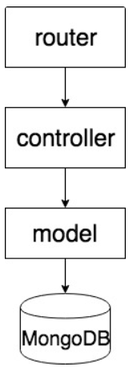

## 初始化实战项目
    
    npm init 
    npm install --save express body-parser mongoose
    
    express nodejs框架
    body-parser 是express结合使用的中间件,解析客户端请求
    mongoose 类似orm对象关系模型
    
    在package.json能查看数据
    
## 先理解项目架构

    1.model模型层
    2.controller定义crud操作
    3.router路由层
    
## 首先需要一个仓位数据模型

model-->position.js

    var mongoose = require('mongoose');
    var Schema = mongoose.Schema;

    var PositionSchema = new Schema({
        account: {type: String, required: true},
        stock: {type: String, required: true},
        quantity: {type: Number, required: true},
        price: {type: Number, required: true}
    });

    module.exports = mongoose.model('Position', PositionSchema);
    
## 控制器

controllers-->position.js

    var Position = require('../models/position');

    // Create
    exports.createPosition = function(req, res) {
        var position = new Position(
            {
                account: req.body.account,
                stock: req.body.stock,
                quantity: req.body.quantity,
                price: req.body.price
            }
        );

        position.save(function (err) {
            if (err) {
                return next(err)
            }
            res.send('仓位记录添加成功')
        })
    };

    // Read
    exports.queryPosition = function(req, res) {
        Position.find({account: req.params.account}, function(err, position) {
            if (err) return next(err);
            res.send(position);
        })
    };

    // Update
    exports.updatePosition = function(req, res) {
        Position.findByIdAndUpdate(req.params.id, {$set: req.body}, function(err, position) {
            if (err) next(err);
            res.send('仓位记录更新成功');
        })
    };

    // Delete
    exports.deletePosition = function(req, res) {
        Position.findByIdAndRemove(req.params.id, function(err) {
            if (err) return next(err);
            res.send('仓位记录删除成功');
        })
    };
    
## 路由

将请求分配给控制器 routes --> position.js

    var express = require('express');
    var router = express.Router();

    var positionController = require('../controllers/position');

    router.post('/create', positionController.createPosition);

    router.get('/:account', positionController.queryPosition);

    router.put('/:id/update', positionController.updatePosition);

    router.delete('/:id/delete', positionController.deletePosition);

    module.exports = router;
    
## 将所有组件串联起来 app.js

    var express = require('express');
    var app = express();

    // Set up mongoose connection
    var mongoose = require('mongoose');
    // mongodb://<user>:<pwd>@<host>:<port>/<database>
    var mongoDB = 'mongodb://localhost:27017/demo';
    mongoose.connect(mongoDB, {useNewUrlParser: true});
    var db = mongoose.connection;
    db.on('error', console.error.bind(console, 'MongoDB连接异常:'));

    var bodyParser = require('body-parser');
    app.use(bodyParser.json());
    app.use(bodyParser.urlencoded({extended: false}));

    var position = require('./routes/position');
    app.use('/position', position);

    var port = 8888;
    app.listen(port, () => {
        console.log('仓位记录管理服务运行中...')
    });
    
## 运行成功
    
    node app.js
    
    postman测试插入数据
    
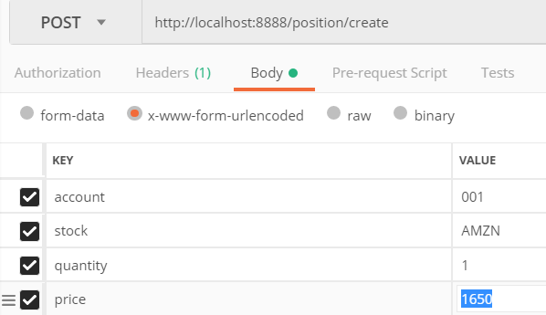

查询数据是否插入
    
    show dbs
    use demo
    db.positions.find()
    
接口
    
    http://localhost:8888/position/001 查询数据
    http://localhost:8888/position/5d4be980e0e4f8308c17db1d/update 更新文档
    http://localhost:8888/position/5d4be980e0e4f8308c17db1d/delete 删除文档
    
# 第7章 MongoDB之数据模型

## 文档结构与简单的文档关系

没有固定的数据格式不等于无需设计数据模型

文档结构-->数据之间的关系

内嵌式结构vs规范式结构

### 内嵌式结构

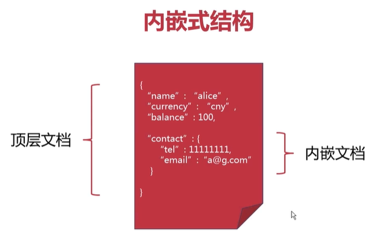

### 规范式文档


        
### 文档关系一对一

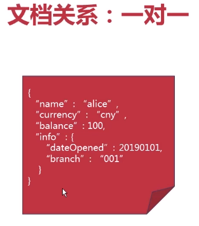

一次查询就可以返回所有数据

更具有独立性的数据应作为顶层文档

补充性数据应作为内嵌文档

### 文档关系一对多

内嵌方式

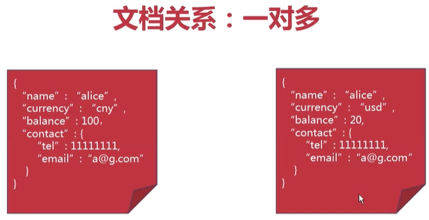

    一次查询就可以返回所有数据
    
    更新内嵌文档复杂度增高
    
    适合读取频率远高于更新频率的数据

规范方式

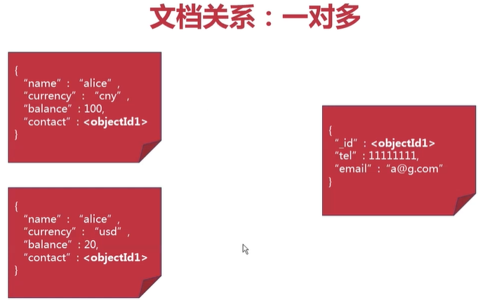

    减少了重复数据
    降低文档更新的复杂度
    需要多次读取操作才能得到完整的数据
    
更多文档结构方式


    适合常常需要返回全部相关文档查询
    数组元素较多时,避免使用内嵌文档
    数组元素极多时,重新设计文档结构
    
## 树形文档关系

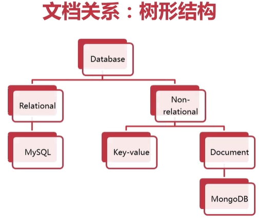

mongo怎么表达这样数据结构?

通过建立一个指向父节点字段

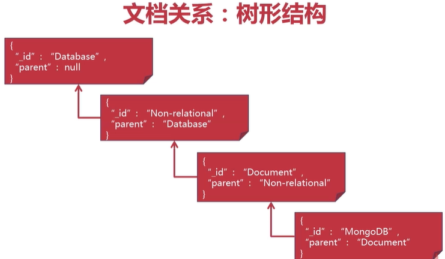

通过建立一个指向子节点字段

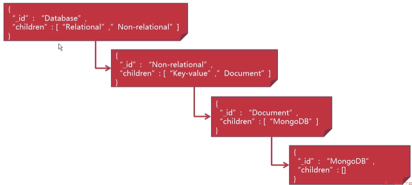

如果常常需要提取子级树,适合这种方式


### 深度遍历


    左边编号永远大于根节点左边
    右边编号永远小于根节点右边
    
用mongo表示
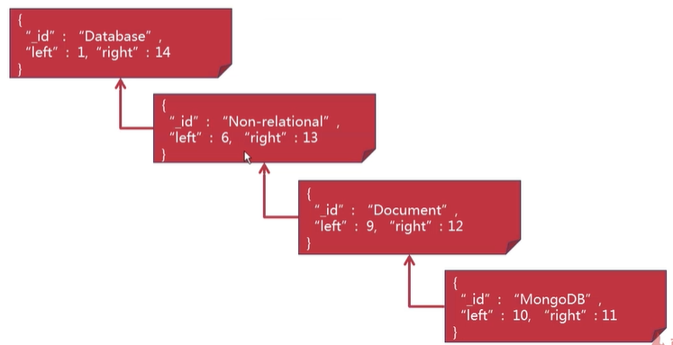

    这样发现,我们要找到Non-relational下的所有子节点,只需要查找所有大于left和小于right的文档
    这个的结构一般用于参考数据,而不常常的更新他
        
# 第8章 MongoDB之复制集
## 复制集基本概念
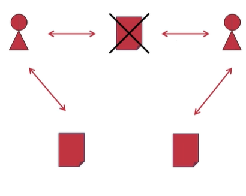

    高可用性
    数据安全
    分流/分工

复制集


    主节点负责处理所有的写入请求
    主节点默认和副节点都可用处理读取请求
    副节点从主节点(或者符合条件副节点)复制数据
    
复制集节点的心跳请求


    每个节点都会向其他节点发送心跳请求
    每隔2秒发送一次,超过10秒则请求超时(默认)
    复制集中最多可以有50个节点
    
## 复制集选举

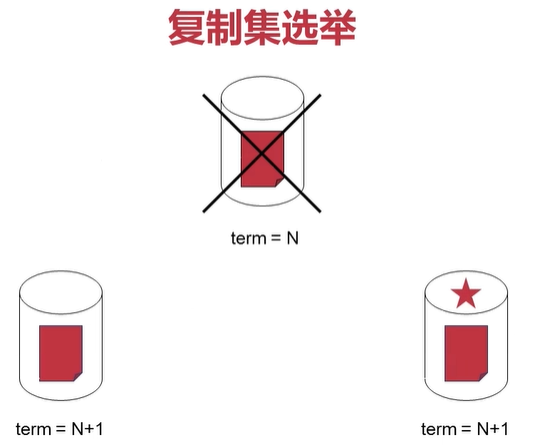

    候选节点发起选举,每个节点投票给比自己更同步的节点,发起投票的节点会投票自己
    得到超过半数选票的候选节点会当选为主节点
    复制集中最多可以有7个投票节点
    
触发选举的事件

    主节点与副节点之间的心跳请求超时
    复制集初始化
    新节点加入复制集
    
投票机,实际上是特殊的主节点

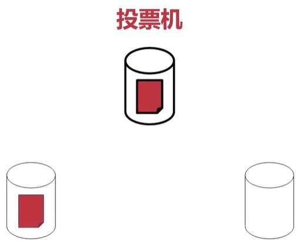

    没有数据
    可以投票
    不能成为主节点

## 写库记录

这里先了解初始同步

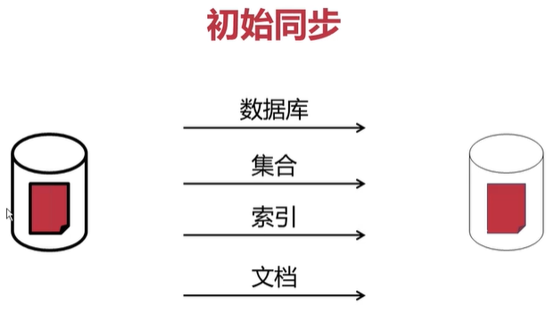

    先后会清空需要同步数据库,在进行初始化
    
写库记录同步

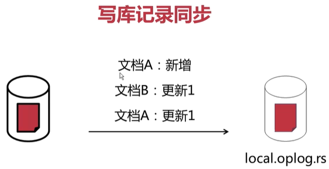

    写库日志中的记录可以被重复使用
    多个线程分批次使用日志记录
    写库日志的大小和文档大小不一定成正比
    
## 搭建MongoDB复制集之启动节点

为了创建复制集用到docker,在现实环境不是一个非常好的docker模式

    创建docker network
    docker network create mynetwork
    docker network ls
    
    运行3个mongod节点
    docker run --net mynetwork --name mongo1 -v /mymongo/data1:/data/db/ -p 27017:27017 -d mongo:4 --replSet myset --port 27017
    docker run --net mynetwork --name mongo2 -v /mymongo/data2:/data/db/ -p 27018:27018 -d mongo:4 --replSet myset --port 27018
    docker run --net mynetwork --name mongo3 -v /mymongo/data3:/data/db/ -p 27019:27019 -d mongo:4 --replSet myset --port 27019

## 搭建MongoDB复制集之创建复制集

    docker exec -it mongo1 mongo
    
    进入mongo shell
        
        rs.initiate(
            {
                _id: "myset",
                members: [
                    {_id: 0, host: "mongo1:27017"},
                    {_id: 1, host: "mongo2:27018"},
                    {_id: 2, host: "mongo3:27019"},
                ]
            }
        )
        
    查询复制集的状态
        rs.status()
        
    返回数据中
        members字段name是mongo1:27017,stateStr是PRIMARY主节点
        字段name是mongo2:27018,stateStr是SECONDARY二级节点
        
    并且mongo shell提示符变成了
        myset:PRIMARY
        
# 第9章 MongoDB之数据分片
   
# 第10章 MongoDB之数据安全

# 第11章 MongoDB之管理工具

# 第12章 MongoDB之故障诊断

## 故障诊断之响应时间长问题解决方案

    对于一般的web服务来说,响应时间应该在200ms以内
    对于一般的mongoDB请求来说,响应时间应该在100ms以内
    
    合适的索引
    使用explain()查看索引的有效性
    工作集超出RAM大小
    使用mongostart查看服务器状态

## 故障诊断之内存不足问题模拟
    
    在生产环境中,先模式一下问题,在docker启动mongod是我们可以传入一个配置文件,配置文件中缓存最大的大小
    docker run --name mymongo -v /Users/apple/Documents/workspace/imooc/mongodb/demo/data:/data/db -d mongo:4 mongod -f /data/db/mongo.conf
    
可以修改一下配置文件,给一个缓存大小0.25


启动docker,传入mongod中 -f

    docker run --name mymongo -v /Users/apple/Documents/workspace/imooc/mongodb/demo/data:/data/db -d mongo:4 mongod -f /data/db/mongo.conf

导入海量数据
    
    docker exec -it mymongo bash 进入mongod
    /data/db/scripts/load-large-dataset.sh 运行导入数据
    
使用mongostat监控服务器进程状态

    mongostat --host localhost --port 27017 -o "command,dirty,used,vsed,res,conn,time"
    
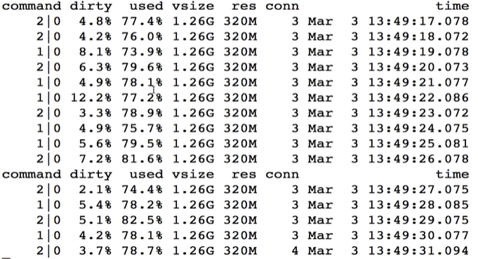

    used百分比远远高于dirty百分比,说明工作集的大小超过了缓存的大小
    
## 故障诊断之连接失败问题

默认情况下,mongod进程可以支持多达65536个连接

不恰当的配置可能限制连接数

查看支持的连接数

    db.serverStatus().connections
    
    返回
        { "current" : 1, "available" : 838859, "totalCreated" : 2, "active" : 1 }
        
        current服务器有1个连接
        available还可以创建多少连接
        totalCreated总共创建过多少个连接
        active正在活跃的连接
        
    mongo.conf文件
        
        maxIncomingConnections: 200
        
## 故障诊断之最大连接数问题

    我在配置文件mongo.conf最大连接数是2000
    
    但是db.serverStatus().connections返回只有1600
    
查看 ulimit -a会看到open files是2000,也就是说docker容器最大文件描述器数量是2000,

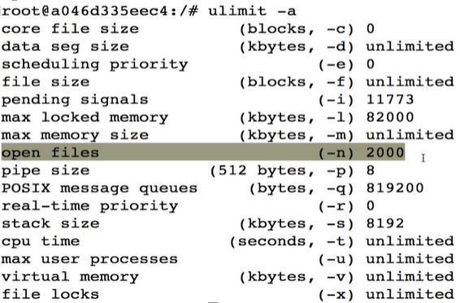

我们知道mongodb每一个连接,每一个集合,都需要文件描述器,如果文件描述器总量是2000个话,所以留个连接数就少了