*   [第1章 容器技术和Docker简介](#第1章-容器技术和Docker简介)
    *   [容器技术概述](#容器技术概述)
*   [第2章 Docker环境的各种搭建方法](#第2章-Docker环境的各种搭建方法)
    *   [Docker安装简介](#Docker安装简介)
    *   [在ubuntu上安装Docker](#在ubuntu上安装Docker)
    *   [VirtualBox安装](#VirtualBox安装)
    *   [Vagrant安装Windows](#Vagrant安装Windows)
    *   [Docker Machine的本地使用](#Docker-Machine的本地使用)
    *   [Docker Machine在阿里云上的使用](#Docker-Machine在阿里云上的使用)
    *   [Docker Machine在亚马逊AWS云上的使用](#Docker-Machine在亚马逊AWS云上的使用)
    *   [Docker Playground](#Docker-Playground)
*   [第3章 Docker的镜像和容器](#第3章-Docker的镜像和容器)
    *   [Docker架构和底层技术简介](#Docker架构和底层技术简介)
    *   [Docker Image概述](#Docker-Image概述)
    *   [DIY一个Base Image](#DIY一个Base-Image)
        *   [构建一个 hello-word 镜像](#构建一个-hello-word-镜像)
    *   [初识Container](#初识Container)
    *   [构建自己的Docker镜像](#构建自己的Docker镜像)
    *   [Dockerfile语法梳理及最佳实践](#Dockerfile语法梳理及最佳实践)
    *   [RUN vs CMD vs Entrypoint](#RUN-vs-CMD-vs-Entrypoint)
        *   [shell格式和exec格式区别-先定义2个dockerfile](#shell格式和exec格式区别-先定义2个dockerfile)
        *   [CMD](#CMD)
        *   [ENTRYPOINT-运用较多](#ENTRYPOINT-运用较多)
    *   [镜像的发布](#镜像的发布)
    *   [Dockerfile实战一](#Dockerfile实战一)
    *   [容器的操作](#容器的操作)
    *   [Dockerfile实战二](#Dockerfile实战二)
    *   [容器的资源限制](#容器的资源限制)
*   [第4章 Docker的网络](#第4章-Docker的网络)
    *   [本章概述和实验环境介绍](#本章概述和实验环境介绍)
    *   [网络基础回顾](#网络基础回顾)
    *   [Linux网络命名空间](#Linux网络命名空间)
    *   [Docker bridge0详解](#Docker-bridge0详解)
        *   [2个容器通信](#2个容器通信)
        *   [怎么访问外网](#怎么访问外网)
    *   [容器之间的link](#容器之间的link)
    *   [容器的端口映射](#容器的端口映射)
    *   [容器网络之host和none](#容器网络之host和none)
        *   [查看none网络](#查看none网络)
        *   [host](#host)
    *   [多容器复杂应用的部署演示](#多容器复杂应用的部署演示)
        *   [先起一个redis](#先起一个redis)
        *   [在起一个flask服务](#在起一个flask服务)
    *   [Overlay和Underlay的通俗解释](#Overlay和Underlay的通俗解释)
    *   [Docker Overlay网络和etcd实现多机容器通信](#Docker-Overlay网络和etcd实现多机容器通信)
*   [第5章 Docker的持久化存储和数据共享](#第5章-Docker的持久化存储和数据共享)
    *   [本章介绍](#本章介绍)
    *   [数据持久化之Data Volume](#数据持久化之Data-Volume)
    *   [数据持久化之Bind Mouting](#数据持久化之Bind-Mouting)
    *   [开发者利器-Docker Bind Mout](#开发者利器-Docker-Bind-Mout)
*   [第6章 Docker Compose多容器部署](#第6章-Docker-Compose多容器部署)
    *   [根据前面所学部署一个wordpress](#根据前面所学部署一个wordpress)
    *   [Docker Compose到底是什么](#Docker-Compose到底是什么)
        *   [docker-compose.yml 三大概念](#docker-compose.yml-三大概念)
    *   [Docker Compose的安装和基本使用](#Docker-Compose的安装和基本使用)
        *   [启动一个flask redis 案例](#启动一个flask-redis-案例)
    *   [水平扩展和负载均衡](#水平扩展和负载均衡)
    *   [部署一个复杂的投票应用](#部署一个复杂的投票应用)
*   [第7章 容器编排Docker Swarm](#第7章-容器编排Docker-Swarm)
    *   [容器编排Swarm介绍](#容器编排Swarm介绍)
    *   [创建一个三节点的swarm集群](#创建一个三节点的swarm集群)
    *   [Service的创建维护和水平扩展](#Service的创建维护和水平扩展)
    *   [在swarm集群里通过service部署wordpress](#在swarm集群里通过service部署wordpress)
    *   [集群服务间通信之Routing Mesh](#集群服务间通信之Routing-Mesh)
    *   [Routing Mesh之Ingress负载均衡](#Routing-Mesh之Ingress负载均衡)
    *   [Docker Stack部署Wordpress](#Docker-Stack部署Wordpress)
    *   [部署投票应用](#部署投票应用)
    *   [Docker Secret管理和使用](#Docker-Secret管理和使用)
    *   [Docker Secret在Stack中的使用](#Docker-Secret在Stack中的使用)
    *   [Service更新](#Service更新)
*   [第8章 DevOps初体验——Docker Cloud和Docker企业版](#第8章-DevOps初体验——Docker-Cloud和Docker企业版)
    *   [Docker Cloud简介](#Docker-Cloud简介)
    *   [Docker Cloud之自动build Docker image](#Docker-Cloud之自动build-Docker-image)
    *   [Docker Cloud之持续集成和持续部署](#Docker Cloud之持续集成和持续部署)
    *   [Docker企业版的在线免费体验](#Docker企业版的在线免费体验)
    *   [Docker企业版本地安装之UCP](#Docker企业版本地安装之UCP)
    *   [Docker企业版本地安装之DTR](#Docker企业版本地安装之DTR)
    *   [Docker企业版UCP的基本使用演示](#Docker企业版UCP的基本使用演示)
    *   [体验阿里云的容器服务](#体验阿里云的容器服务)
    *   [在阿里云上安装Docker企业版](#在阿里云上安装Docker企业版)
    *   [Docker企业版DTR的基本使用演示](#Docker企业版DTR的基本使用演示)
*   [第9章 容器编排Kubernetes](#第9章-容器编排Kubernetes)
    *   [Minikube快速搭建K8S单节点环境](#Minikube快速搭建K8S单节点环境)
    *   [K8S最小调度单位Pod](#K8S最小调度单位Pod)
    *   [ReplicaSet和ReplicationController](#ReplicaSet和ReplicationController)
        *   [ReplicationController](#ReplicationController)
        *   [ReplicaSet](#ReplicaSet)
    *   [Deployment](#Deployment)
        *   [实现对外访问](#实现对外访问)
    *   [使用Tectonic在本地搭建多节点K8S集群](#使用Tectonic在本地搭建多节点K8S集群)
    *   [k8s基础网络Cluster Network](#k8s基础网络Cluster-Network)
    *   [Service简介和演示](#Service简介和演示)
        *   [clusterip](#clusterip)
    *   [NodePort类型Service以及Label的简单实用](#NodePort类型Service以及Label的简单实用)
        *   [Label的简单实用](#Label的简单实用)
    *   [准备工作——使用kops在亚马逊AWS上搭建k8s集群](#准备工作——使用kops在亚马逊AWS上搭建k8s集群)
    *   [使用kops在亚马逊AWS上搭建k8s集群](#使用kops在亚马逊AWS上搭建k8s集群)
    *   [LoadBlancer类型Service以及AWS的DNS服务配置](#LoadBlancer类型Service以及AWS的DNS服务配置)
    *   [在亚马逊k8s集群上部署wordpress](#在亚马逊k8s集群上部署wordpress)
*   [第10章 容器的的运维和监控](#第10章-容器的的运维和监控)
    *   [容器的基本监控](#容器的基本监控)
    *   [k8s集群运行资源监控——Heapster+Grafana+InfluxDB](#k8s集群运行资源监控——Heapster+Grafana+InfluxDB)
    *   [根据资源占用自动横向伸缩](#根据资源占用自动横向伸缩)
    *   [k8s集群Log的采集和展示——ELK+Fluentd](#k8s集群Log的采集和展示——ELK+Fluentd)
    *   [k8s集群监控方案Prometheus](#k8s集群监控方案Prometheus)
*   [第11章 Docker+DevOps实战——过程和工具](#第11章-Docker+DevOps实战——过程和工具)
    *   [搭建GitLab服务器](#搭建GitLab服务器)
    *   [搭建GitLab CI服务器和Pipeline演示](#搭建GitLab-CI服务器和Pipeline演示)
    *   [基于真实Python项目的CI演示](#基于真实Python项目的CI演示)
    *   [使用Python项目演示的CICD流程](#使用Python项目演示的CICD流程)
    *   [CI实现版本自动发布](#CI实现版本自动发布)

# 第1章 容器技术和Docker简介

dockerhub 

    https://hub.docker.com/
    
docker

    https://www.docker.com/

## 容器技术概述

历史部署

    部署非常慢
    成本非常高
    资源浪费
    难于迁移和扩展
    可能会被限定硬件厂商
    
虚拟化技术出现以后

    一个物理机可以部署多个app
    每个app安装在不同的虚拟机里
    
虚拟化的优点

    资源池:一个物理机的资源分配到了不同的虚拟机里
    很容易扩展:加物理机器or加虚拟机
    很容易云化:亚马逊aws,阿里云
    
虚拟化的局限性

    每一个虚拟机都是一个完整的操作系统,要给其分配资源,
    当虚拟机数量增多是,操作系统本身消耗的资源必然增多
    
开发和运维面临的挑战

    容器技术提供了一种app的打包
    解决了开发的运维之间的矛盾
    在开发和运维之间搭建了一个桥梁,是实现devops的最佳解决方案
    
什么是容器

    对软件和其依赖的标准打包
    应用之间相互隔离
    共享同一个 os kernel
    可以运行在很多主流操作系统上
    
容器和虚拟机的区别

    容器是app层面的隔离
    虚拟化是物理资源层面的隔离
    
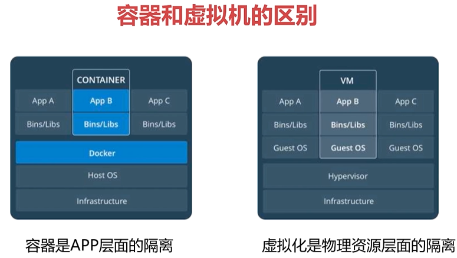

# 第2章 Docker环境的各种搭建方法

## Docker安装简介

文档 https://docs.docker.com/install/overview/

    社区版（CE）
    企业版（EE）
    
## 在ubuntu上安装Docker

卸载旧版本

    sudo apt-get remove docker docker-engine docker.io containerd runc
    
更新apt包索引

    sudo apt-get update
    
安装包以允许apt通过HTTPS使用存储库：

    sudo apt-get install \
        apt-transport-https \
        ca-certificates \
        curl \
        gnupg-agent \
        software-properties-common
        
添加Docker的官方GPG密钥

    curl -fsSL https://download.docker.com/linux/ubuntu/gpg | sudo apt-key add -
    
安装最新版本的Docker CE和containerd

    sudo apt-get install docker-ce docker-ce-cli containerd.io
    
通过运行hello-world 镜像验证是否正确安装了Docker CE

    sudo docker run hello-world
    
升级DOCKER CE

    要升级Docker CE，请先运行sudo apt-get update，然后按照 安装说明选择要安装的新版本。
    
文档 

    https://docs.docker.com/install/linux/docker-ce/ubuntu/
    
## VirtualBox安装

文档 https://www.virtualbox.org/wiki/Downloads

## Vagrant安装Windows

文档 https://www.vagrantup.com/downloads.html

通过 Vagrant 创建虚拟机,必须管理员运行cmd
    
    mkdir centos7
    cd centos7
    vagrant init centos/7 # 初始化一台机器 Vagrantfile 描述了创建机器内容
    vargrant up # 创建一台centos7机器
    vargrant ssh # 进入虚拟机
    
## Docker Machine的本地使用

首先安装docker-machine 

    文档 https://docs.docker.com/machine/install-machine/#install-machine-directly
    
    $ base=https://github.com/docker/machine/releases/download/v0.16.0 &&
      curl -L $base/docker-machine-$(uname -s)-$(uname -m) >/tmp/docker-machine &&
      sudo install /tmp/docker-machine /usr/local/bin/docker-machine

查看版本

    docker-machine version
    
创建一台虚拟机

    docker-machine create demo
    
查看当前创建的机器

    docker-machine ls
    
进入虚拟机

    docker-machine ssh demo
    

## Docker Machine在阿里云上的使用

## Docker Machine在亚马逊AWS云上的使用

## Docker Playground

用docker id登录

aiyingfeng110

q50962285q

文档 https://labs.play-with-docker.com/

Docker是一个开源的应用容器引擎，让开发者可用打包应用以及依赖包到一个可移植的容器，发布到任意Linux机器。Docker使部署更加快。

# 第3章 Docker的镜像和容器

## Docker架构和底层技术简介

docker提供了一个开发,打包,运行app的平台

把app和底层infrastructure隔离开来

查看 docker版本信息

    docker version
    
查看 docker 进程

    ps -ef|grep docker
    
docker 架构

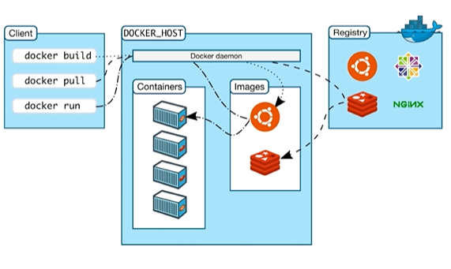

底层技术支持

    namespaces: 做隔离pid,net,ipc,mnt,uts
    control groups:做资源限制
    union file systmes:container和image的分层
    
## Docker Image概述

什么是image
    
    文件和meta data的集合
    分层的,并且每一层都可以添加改变删除文件,成为一个新的image
    不同的image可以共享相同的layer
    image本身是read-only的
    
查看本地的 docker image

    docker images
    
去dockerhub拉取镜像image

    docker pull ubuntu:16
    
dokerhub是免费的镜像仓库

    https://hub.docker.com/
    
## DIY一个Base Image

取消 sudo 权限

    sudo groupadd docker
    sudo gpasswd -a 用户名 docker
    重启系统
    docker version
    
### 构建一个 hello-word 镜像 

vim Dockerfile

    FROM scratch # 基于一个空镜像创建
    ADD hello /  # 将hello文件添加到 "/" 目录里面
    CMD ["/hello"] # 从更目录运行文件
    
构建镜像

    docker build -t ayf/hello-world .
    
查看镜像

    docker images
    
查看 docker 镜像分层

    docker history 镜像id
    
## 初识Container

    通过image创建 copy
    在image layer之上建立一个container layer 可读写
    类比面向对象 类和实例
    image负责app存储个分发,container负责运行app
    
创建并运行容器

    docker run ayf/hello-world
    
查看所有容器(运行中/停止中)

    docker container ls -a 或者 docker ps -a
    
交互式运行 

    docker run -it ubuntu
    
删除容器

    docker rm 容器ia
    
删除镜像
    
    docker image rm 镜像id 
    或者 
    docker rmi 镜像id
    
列出所有容器id

    docker container ls -aq
    
删除所有容器

    docker rm $(docker container ls -aq)
    
删除停止运行的容器

    docker rm $(docker container ls -f "status=exited" -q)
    
## 构建自己的Docker镜像

通过创建的容器构建新的镜像(不建议用这种方式创建image,因为别人不知道这个image是怎么产生的)

    docker run -it ubuntu # 创建一个ubuntu容器
    sudo apt-get install vim # 安装vim
    docker ps -a # 查看容器信息
    docker commit 容器name ayf/ubuntu-vim # 构建新的镜像
    docker images # 查看镜像

通过 Dockerfile 安装vim

    FROM ubuntu
    RUN apt-get update \
        && apt-get -y install vim
    
构建镜像

    docker build -t ayf/ubuntu-vim .
    
## Dockerfile语法梳理及最佳实践

FROM 尽量使用官方的image作为base image

    FROM scratch # 制作 base image
    FROM centos # 使用 base image
    FROM ubuntu:14.04 

LABEL 定义了作者,版本,描述

    LABEL maintaniner = "aiyingfeng@qq.com"
    LABEL version = "1.0"
    LABEL description = "This is description"
    
RUN 合并多条命令为一行

    RUN apt-get update \
        && apt-get -y install vim
        
WORKDIR 进入工作目录,尽量用绝对目录不建议用 RUN cd

    WORKDIR /test # 如果没有会自动创建test目录
    WORKDIR demo
    RUN pwd # 输出结果应该是 /test/demo
    
ADD and COPY(不能解压),添加远程文件/目录请使用curl或者wget

    ADD hello / # 将hello文件添加到根目录
    ADD test.tar.gz / #将文件添加到根目录并解压
    
    WORKDIR /root
    ADD hello test/ # /root/test/hello
    
    WORKDIR /root
    COPY hello test/ # /root/test/hello
    
ENV 增加dockerfile可维护性

    ENV MYSQL_VERSION 5.6 # 设置常量
    RUN apt-get install -y mysql-server= "{MYSQL_VERSION}" \ # 引用常量
        && rm -rf /var/lib/apt/lists/* # 主要是减少最终镜像的大小,通常是可以减少21M以上

## RUN vs CMD vs Entrypoint

    RUN: 执行命令并创建新的image Layer
    CMD: 设置容器启动后默认执行的命令和参数 
    Entrypoint: 设置容器启动是运行的命令
  
shell格式

    RUN apt-get install -y vim
    CMD echo "hello docker"
    ENTRPOINT echo "hello docker"
    
Exec格式

    RUN ["apt-get", "install", "-y", "vim"]
    CMD ["/bin/echo", "hello docker"]
    ENTRYPOINT ["/bin/echo" ,"hello docker"]
    
### shell格式和exec格式区别-先定义2个dockerfile

Dockerfile1

    FROM centos
    ENV name docker
    ENTRYPOINT echo "hello $name"
    
Dockerfile2

    FROM centos
    ENV name docker
    ENTRYPOINT ["/bin/echo", "hello $name"]
    
构建镜像后run运行容器,发现shell格式打印出了变量 "name" ,exec打印出了 $name

所有需要将exec格式在运行代码是通过shell运行

    FROM centos
    ENV name docker
    ENTRYPOINT ["/bin/bash", "-c", "echo hello $name"]
    
### CMD

Dockerfile

    FROM centos
    ENV name docker
    CMD echo "hello $name"
    
容器启动是默认执行的命令

    CMD echo "hello $name"
    
如果docker run指定其他命令,cmd命令被忽略
    
    docker run -it 镜像名 /bin/bash #这里就不会打印 "docker"
    
如果定义了多个CMD.只有最后一个会执行

### ENTRYPOINT-运用较多

    让容器以应用程序或者服务形式运行
    不会被忽略,一定会执行
    最佳实践:写一个shell脚本作为ENTRYPOINT
    
同样上面案例 run 运行

    docker run -it 镜像名 /bin/bash #这里会打印 "docker"
    
## 镜像的发布

将自己构建的镜像发布到dockerhub上
    
    docker login # 登录docker
    docker push aiyingfeng110/ubuntu-vim:latest # push上去,注意 aiyingfeng110 必须是dockerhub的账户id
    
    docker pull aiyingfeng110/ubuntu-vim # 拉取镜像
    
搭建私有的dockerhub仓库

    文档 https://hub.docker.com/_/registry
    
## Dockerfile实战一

构建思想

    1. 确定运行环境
    2. 代码在哪个目录
    3. 运行代码

编写flask

    from flask import Flask
    app = Flask(__name__)
    @app.route('/')
    def hello():
        return "hello docker"
    if __name__ == '__main__':
        app.run(host="0.0.0.0", port=5000)

构建dockerfile

    FROM python:2.7
    LABEL maintaniner="aiyingfeng@qq.com"
    RUN pip install flask
    COPY app.py /app/
    WORKDIR /app
    EXPOSE 5000
    CMD ["python", "app.py"]
    
启动 -t 是给容器分配一个伪终端

    docker build -t aiyingfeng110/flask-hello-world .
    docker run aiyingfeng110/flask-hello-world
    
## 容器的操作

对运行中容器操作,进入容器

    docker exec -it 6ae843eb7039 /bin/bash
    
打印出运行中容器的ip地址

    docker exec -it 6ae843eb7039 ip a
    
停止容器

    docker stop 容器id
    
启动容器

    docker start 容器id
    
删除所有容器

    docker rm $(docker ps -aq)
    
容器的详细信息

    docker inspect 容器id

容器输出日志

    docker logs 容器id

## Dockerfile实战二

用到 stress 工具

    安装 apt-get install stress
    
命令

    stress --vm 1 #启动一个 worker,默认站256M内存
    stress --vm 1 --verbose # debug模式
    stress --vm 1 --vm-bytes 50000M --verbose # 启动一个worker,占50000M内存

构建一个liunx系统测试压力工具

    FROM ubuntu
    RUN apt-get update && apt-get install -y stress
    ENTRYPOINT ["/usr/bin/stress"] # 运行 stress
    CMD [] # 空列表就是要传递参数进来
    
构建镜像

    docker build -t aiyingfeng110/ubuntu-stress .
    
创建并运行容器

    docker run aiyingfeng110/ubuntu-stress
    
传入参数

    docker run aiyingfeng110/ubuntu-stress --vm 1
    docker run aiyingfeng110/ubuntu-stress --vm 1 --verbose
    
## 容器的资源限制

限制容器占用物理内存

    docker run --memory=200M aiyingfeng110/ubuntu-stress --vm 1
    
启动容器占用cup权重 --cpu-sharse=10 的10是权重

    docker run --cpu-shares=10 --name=test1 aiyingfeng110/ubuntu-stress --cpu 1
    
在启动一个权重是5的

    docker run --cpu-shares=5 --name=test2 aiyingfeng110/ubuntu-stress --cpu 1

单核cup效果,出现权重分配cpu

# 第4章 Docker的网络

## 本章概述和实验环境介绍

docker network种类

    单机:Bridge Network Host Network None Network
    多机:Overlay Network
    
## 网络基础回顾

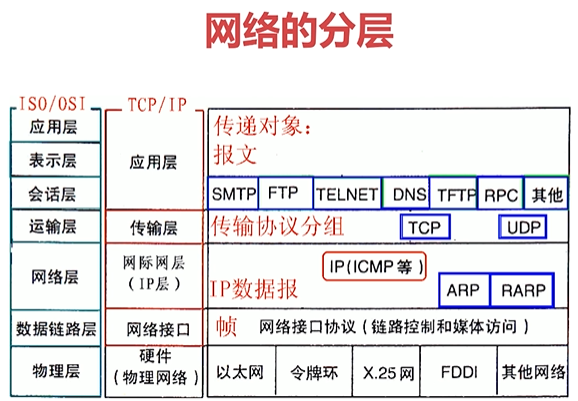

公有ip:互联网上唯一标示,可以访问internet

私有ip:不可在互联网上使用,仅供机构内部使用

网络地址转换NAT

ping和telnet
    
    ping ip:验证ip的可达性
        ping www.imooc.com
        
    telnet:验证服务的可用性
        telnet www.imooc.com 80
        
## Linux网络命名空间

我们创建一个容器通同时创建一个 network namespace 容器成为一个独立网络空间

查看网络命名空间 network namespace

    ip a 
    
通过创建2个容器

    docker run --name=test1 ubuntu
    docker run --name=test2 ubuntu
 
进入其中容器是可以ping通列一个容器的地址

    
## Docker bridge0详解

docker 是怎么将2个容器连接在一起的

docker默认有3种网络连接方式

查看docker网络

    docker network ls
    
查看容器network信息

    docker network inspect 容器id
    
查询容器网络信息

     docker exec b5d33f20354f ip a

安装 linux系统网桥管理工具brctl,查看所有的网桥信息

     apt-get  install bridge-utils
     brctl show
     
打印的信息,发现docker0这个网络有很多个 veth 接口,查看docker容器网络也会发现 veth 接口
     
     
     
查看birdge网络上连接的容器

    docker network inspect bridge

### 2个容器通信

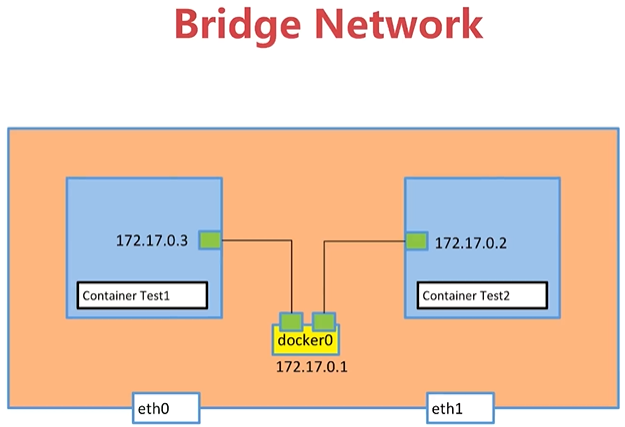

### 怎么访问外网

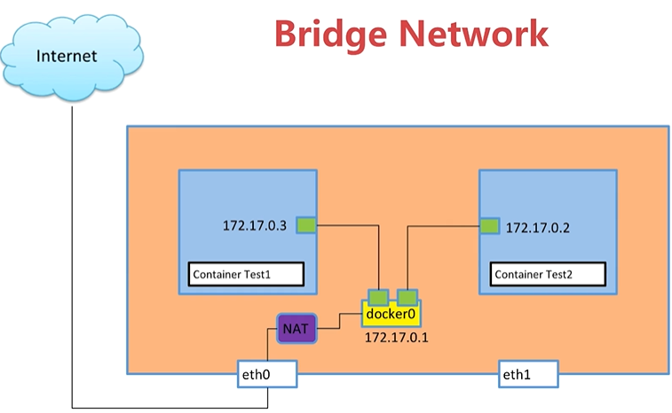

## 容器之间的link

后台项目访问数据库mysql,需要ip和端口,现在我们只需要知道容器名字就可以进行访问,这就是link

    docker run -d --name test1 --link mysql_test 容器id
    进入容器
    ping mysql:3306 是可以通的
    
我们新建的容器会默认连接到bridge网络,也可以连接host,也可以新建一个network

    docker network create -d bridge my-bridge
    docker network ls # 查看网络
    brctl show # 查看所有的网桥信息
    docker network inspect my-bridge # 查询容器连接信息
    
我们也可以将test2容器连接到自定义的 my-bridge 网络上

    docker network connect my-bridge test2
    
在将test1容器连接到自定义的 my-bridge 网络上
    
    docker network connect my-bridge test2
    
ping name

    ping test1 是可以ping通的,docker在自定义的网络上的容器默认是link了
    
## 容器的端口映射

我们起一个nginx服务

    docker run --name web -d nginx
    
查看nginx连接的网络是 172.17.0.3

    docker network inspect bridge
    
    Containers": {
        "afd17855a09ef3212d1216f0c92ec852f2567976fc6c77470f88afcf5ee71df8": {
            "Name": "web",
            "EndpointID": "d5dc2886d02616c7619009a745b265dfee6f7dee4681ac729b944bbf46662570",
            "MacAddress": "02:42:ac:11:00:03",
            "IPv4Address": "172.17.0.3/16",
            "IPv6Address": ""
        },
    }

ping 172.17.0.3是可以通的,因为默认都在bridge网络上

现在我要让外面也能访问 nginx 前面的80是本地的80,后面的是容器内端口

    docker run --name web -d -p 80:80 nginx
    
打开浏览器输入ip,(Welcome to nginx!)

    http://192.168.153.159/

docker做了什么工作
    
    1. docker将80端口映射到了容器的80端口
    2. 在将本地的8888端口映射到了docker端口
    3. 这样就能访问nginx
    

## 容器网络之host和none

### 查看none网络

    docker network ls
    
通过创建 nginx 连接 none网络

    docker run -d --name web --network none nginx
    
查看none网络

    docker network inspect none
    
发现 web 连接到了none,但是没有ip地址

    "Containers": {
        "9becbb739baae390e6bbe952703e4c410c27fe0dc42fd35c2824aff3c7e22895": {
            "Name": "web",
            "EndpointID": "23c47977732f1f8dabd74ea861c5e2e0963a6e9a868f5696e535e3e009258a56",
            "MacAddress": "",
            "IPv4Address": "",
            "IPv6Address": ""
        }
    },

进入容器在看 ip a 只有一个回管口以外没有其他接口

    1: lo: <LOOPBACK,UP,LOWER_UP> mtu 65536 qdisc noqueue state UNKNOWN group default qlen 1000
        link/loopback 00:00:00:00:00:00 brd 00:00:00:00:00:00
        inet 127.0.0.1/8 scope host lo
           valid_lft forever preferred_lft forever

这就是一个完成封闭的容器

### host

创建一个连接 host 容器

    docker run -d --name web --network host nginx
    
查看host网络,发现也是没有 ip地址,但是进入容器进行ip a发现共享了主机(本地机)的ip网络.

## 多容器复杂应用的部署演示

2个容器一个flask,一个redis完成一个简单demo

### 先起一个redis

    docker run -d --name redis redis

这里为什么不暴露端口,因为redis只供内部访问,通过另一个容器去访问

### 在起一个flask服务

    from flask import Flask
    from redis import Redis
    import os
    import socket
    
    app = Flask(__name__)
    redis = Redis(host=os.environ.get('REDIS_HOST', '127.0.0.1'), port=6379)
    
    
    @app.route('/')
    def hello():
        redis.incr('hits')
        return 'Hello Container World! I have been seen %s times and my hostname is %s.\n' % (redis.get('hits'),socket.gethostname())
    
    
    if __name__ == "__main__":
        app.run(host="0.0.0.0", port=5000, debug=True)

Dockerfile 文件

    FROM python:2.7
    LABEL maintaner="Peng Xiao xiaoquwl@gmail.com"
    COPY . /app
    WORKDIR /app
    RUN pip install flask redis
    EXPOSE 5000
    CMD [ "python", "app.py" ]
    
打包一个flask镜像
    
    docker build -t aiyingfeng110/flask-redis .
    
运行/创建 -e 设置一个环境变量 REDIS_HOST=reids, --link 连接到 redis 容器

    docker run -d --link reids --name flask-redis -e REDIS_HOST=redis aiyingfeng110/flask-redis

进入到 flask-redis 容器

    docker exec -it flask-redis /bin/bash
    
打印 env ,里面是存在 REDIS_HOST=reids
    
    REDIS_PORT_6379_TCP=tcp://172.17.0.2:6379
    HOSTNAME=bddf95fc70e4
    PYTHON_VERSION=2.7.16
    REDIS_HOST=reids
    REDIS_ENV_REDIS_VERSION=5.0.5
    PWD=/app
    HOME=/root
    LANG=C.UTF-8
    GPG_KEY=C01E1CAD5EA2C4F0B8E3571504C367C218ADD4FF
    REDIS_ENV_REDIS_DOWNLOAD_URL=http://download.redis.io/releases/redis-5.0.5.tar.gz
    REDIS_PORT_6379_TCP_PROTO=tcp
    TERM=xterm
    PYTHONIOENCODING=UTF-8
    SHLVL=1
    REDIS_PORT_6379_TCP_PORT=6379
    REDIS_NAME=/flask-redis/redis
    REDIS_PORT_6379_TCP_ADDR=172.17.0.2
    PYTHON_PIP_VERSION=19.1.1
    REDIS_ENV_GOSU_VERSION=1.10
    REDIS_PORT=tcp://172.17.0.2:6379
    REDIS_ENV_REDIS_DOWNLOAD_SHA=2139009799d21d8ff94fc40b7f36ac46699b9e1254086299f8d3b223ca54a375
    PATH=/usr/local/bin:/usr/local/sbin:/usr/local/bin:/usr/sbin:/usr/bin:/sbin:/bin
    _=/usr/bin/env

既然用了link那我们也是可以去ping redis这个容器的,在容器内访问app

    curl 127.0.0.1:5000
    
    打印
    
    Hello Container World! I have been seen 1 times and my hostname is c4ba4d7c1be0.
    Hello Container World! I have been seen 2 times and my hostname is c4ba4d7c1be0.
    Hello Container World! I have been seen 3 times and my hostname is c4ba4d7c1be0.
    
发现容器内访问redis是没有问题的,app也运行没有问题

如果要在容器外访问,只需要将 flask-redis 端口暴露出来

    docker run -d --link reids -p 5000:5000 --name flask-redis -e REDIS_HOST=redis aiyingfeng110/flask-redis
    
## Overlay和Underlay的通俗解释

上面案例是在同一台机器上,但是多机器?

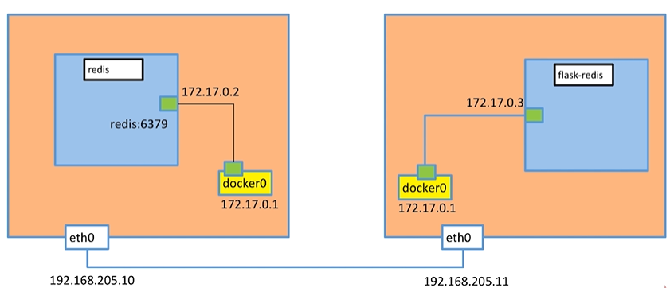

vxlan 文档(通信方式)

    https://cizixs.com/2017/09/25/vxlan-protocol-introduction/

## Docker Overlay网络和etcd实现多机容器通信

先安装etcd实现分布式存储,node1用了ip地址是127.0.0.1,那么node2就是127.0.0.2

安装

    wget https://github.com/coreos/etcd/releases/download/v3.0.12/etcd-v3.0.12-linux-amd64.tar.gz
    
解压

    tar zxvf etcd-v3.0.12-linux-amd64.tar.gz
    
在docker-node1上起一个 etcd 服务

    cd etcd-v3.0.12-linux-amd64
    
    nohup ./etcd --name docker-node1 --initial-advertise-peer-urls http://192.168.205.10:2380 \
    --listen-peer-urls http://192.168.205.10:2380 \
    --listen-client-urls http://192.168.205.10:2379,http://127.0.0.1:2379 \
    --advertise-client-urls http://192.168.205.10:2379 \
    --initial-cluster-token etcd-cluster \
    --initial-cluster docker-node1=http://192.168.205.10:2380,docker-node2=http://192.168.205.11:2380 \
    --initial-cluster-state new&
    
在docker-node2上起一个 etcd 服务

    wget https://github.com/coreos/etcd/releases/download/v3.0.12/etcd-v3.0.12-linux-amd64.tar.gz
    tar zxvf etcd-v3.0.12-linux-amd64.tar.gz
    
    cd etcd-v3.0.12-linux-amd64/
    nohup ./etcd --name docker-node2 --initial-advertise-peer-urls http://192.168.205.11:2380 \
    --listen-peer-urls http://192.168.205.11:2380 \
    --listen-client-urls http://192.168.205.11:2379,http://127.0.0.1:2379 \
    --advertise-client-urls http://192.168.205.11:2379 \
    --initial-cluster-token etcd-cluster \
    --initial-cluster docker-node1=http://192.168.205.10:2380,docker-node2=http://192.168.205.11:2380 \
    --initial-cluster-state new&
    
检查cluster状态

    ./etcdctl cluster-health
    
    打印
    
    member 21eca106efe4caee is healthy: got healthy result from http://192.168.205.10:2379
    member 8614974c83d1cc6d is healthy: got healthy result from http://192.168.205.11:2379
    cluster is healthy
    
这样在2台搭建一个分布式存储

重启docker服务在docker-node1上

    sudo service docker stop
    sudo /usr/bin/dockerd -H tcp://0.0.0.0:2375 -H unix:///var/run/docker.sock --cluster-store=etcd://192.168.205.10:2379 --cluster-advertise=192.168.205.10:2375&
    
重启docker服务在在docker-node2上

    sudo service docker stop
    sudo /usr/bin/dockerd -H tcp://0.0.0.0:2375 -H unix:///var/run/docker.sock --cluster-store=etcd://192.168.205.11:2379 --cluster-advertise=192.168.205.11:2375&

会发现 docker version

    evertmenberjoin: docker-node2 192.168.xxx.xx
    evertmenberjoin: docker-node1 192.168.xxx.xx
    
在docker-node1上创建一个demo的overlay network

    sudo docker network ls
    sudo docker network create -d overlay demo
    
    sudo docker network ls
    sudo docker network inspect demo
    
我们会看到在node2上，这个demo的overlay network会被同步创建

    sudo docker network ls
    
在docker-node1上创建连接demo网络的容器

    sudo docker run -d --name test1 --net demo busybox sh -c "while true; do sleep 3600; done"
    
    sudo docker ps
    
    sudo docker exec test1 ifconfig
    
在docker-node2上创建连接demo网络的容器

    sudo docker run -d --name test2 --net demo busybox sh -c "while true; do sleep 3600; done"
    
    sudo docker ps
    
    sudo docker exec test1 ifconfig
    
查看 demo 网络有多少连接

    sudo docker network inspect demo
    
发现有2个容器连接网络

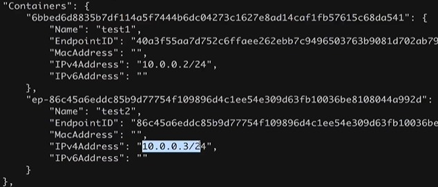

在docker node1 中 ping node2

    sudo docker exec test1 sh -c "ping 10.0.0.3"
    
这样就完成了2台机器docker互通

我们在查看 docker 网络

    sudo docker network inspect ls
    
发现不仅多了个demo网络还多了个docker_gwbridge网络

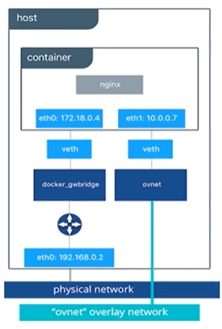

# 第5章 Docker的持久化存储和数据共享

## 本章介绍

我们知道docker镜像(image)是只读的,docker的容器存储的数据在删除容器后,数据就不存在了.

所有如果我们要运行一个数据库的容器,怎么才能保存数据呢

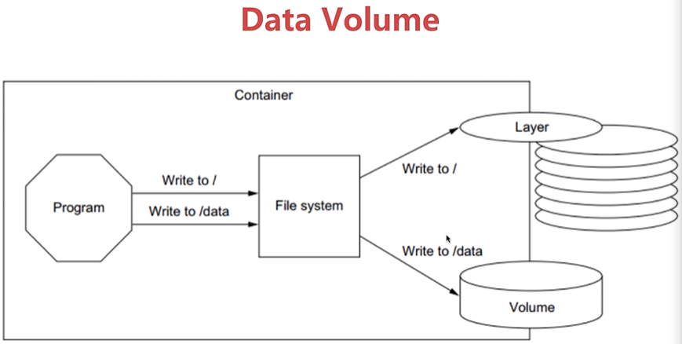

docker 持久化数据的方案

    基于本地文件系统的volume,可以在执行docker create或者docker run 时,通过-v参数将主机的目录作为容器的数据卷.
    基于plugin的volume,支持第三方的存储方案,比如nas,aws
    
volume的类型

    受管理的data volume 由docker 后台自动创建
    绑定挂载的volume,具体挂载位置可以由用户指定
    
## 数据持久化之Data Volume

我们去起个mysql容器

    docker run -d --name mysql mysql
    
docker 官方的Dockerfile默认有Volume,查看本地的volume

    docker volume ls
    docker volume rm volume的id #删除 volume
    
查询volume数据信息

    docker volume inspect volume的id
    
    打印
    
    [
        {
            "CreatedAt": "2019-07-21T13:56:11+08:00",
            "Driver": "local",
            "Labels": null,
            "Mountpoint": "/var/lib/docker/volumes/158f8c3003afdabd0c87ea03ae97ce9099c33ce0143aeb69300cd7f3d8c6afff/_data",
            "Name": "158f8c3003afdabd0c87ea03ae97ce9099c33ce0143aeb69300cd7f3d8c6afff",
            "Options": null,
            "Scope": "local"
        }
    ]

发现数据存储在 /var/lib/docker/volumes/...中

但是这个volumes的名字太长了,所以我们指定volumes名称

    docker run -d -v mysql:/var/lib/mysql --name mysql mysql
    
如果在起一个mysql容器,名称也是mysql:/var/lib/mysql,也会共用一个volume

## 数据持久化之Bind Mouting

文件同步,$(pwd)当前本地的目录,/usr/share/nginx/html工作目录

    docker run -d -v $(pwd):/usr/share/nginx/html -p 80:80 --name web aiyingfeng110/my-nginx
    
这样就文件同步了

## 开发者利器-Docker Bind Mout

打包 flask-skeleton 镜像

    docker build -t aiyingfeng110/flask-skeleton .
    
起一个 flask-skeleton 服务,将当前$(pwd)目录映射到容器/skeleton目录下

    docker run -d -v $(pwd):/skeleton -p 80:5000 --name flask aiyingfeng110/flask-skeleton
    
浏览器打开网址,默认80

    http://192.168.153.160/
    
在修改源代码,发现web页面也会改变.

日常开发非常实用!!!

# 第6章 Docker Compose多容器部署

## 根据前面所学部署一个wordpress

    docker pull wordpress
    docker pull mysql
    docker run -d --name mysql -v mysql-data:/var/lib/mysql -e MYSQL_ROOT_PASSWORD=root -e MYSQL_DATABASE=wordpress mysql:5.7
    
    docker run -d --link mysql -e WORDPRESS_DB_HOST=mysql:3306 -p 8080:80 wordpress
    
## Docker Compose到底是什么

每次这么创建容器,在删除容器,发现非常繁琐,需要有一个批量处理的文件

docker Compose 批处理

    docker compose是一个工具
    这个工具可以通过yml文件定义多个容器的docker应用
    通过一条命令就可以根据yml文件的定义去创建或者管理这多个容器
    
### docker-compose.yml 三大概念

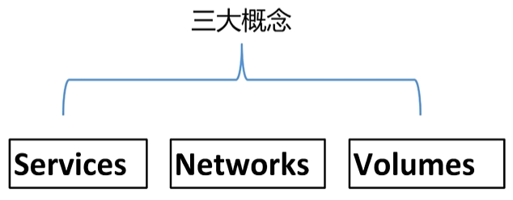

services

    一个services代表一个container,这个container可以从dockerhub的image来创建,或者从本地的dockerfile build出来的image来创建
    services的启动类似docker run,我们可以给其指定network和volume,所有可以给services指定network和volume的引用
    
docker-compose.yml

    version: '3'
    
    services:
    
      wordpress:
        image: wordpress
        ports:
          - 8080:80
        depends_on:
          - mysql
        environment:
          WORDPRESS_DB_HOST: mysql
          WORDPRESS_DB_PASSWORD: root
        networks:
          - my-bridge
    
      mysql:
        image: mysql:5.7
        environment:
          MYSQL_ROOT_PASSWORD: root
          MYSQL_DATABASE: wordpress
        volumes:
          - mysql-data:/var/lib/mysql
        networks:
          - my-bridge
    
    volumes:
      mysql-data:
    
    networks:
      my-bridge:
        driver: bridge
        
## Docker Compose的安装和基本使用

linux 安装
    
    sudo curl -L "https://github.com/docker/compose/releases/download/1.24.1/docker-compose-$(uname -s)-$(uname -m)" -o /usr/local/bin/docker-compose

    docker-compose --version
    
    文档 https://docs.docker.com/compose/install/
    
启动 Docker Compose

    docker-compose up
    
命令
    
    docker-compose ps # 打印 services
    docker-compose stop # 暂停 services
    docker-compose start # 启动 services
    docker-compose down # 删除 services
    
    docker-compose up -d # 后台打开
    docker-compose images # 打印出 container 和 images
    
    docker-compose exec mysql bash # 进入容器
    
### 启动一个flask redis 案例

yml文件

    version: "3"
    
    services:
    
      redis:
        image: redis
    
      web:
        build:
          context: .
          dockerfile: Dockerfile
        ports:
          - 8080:5000
        environment:
          REDIS_HOST: redis

启动

    docker-compose up
    
## 水平扩展和负载均衡

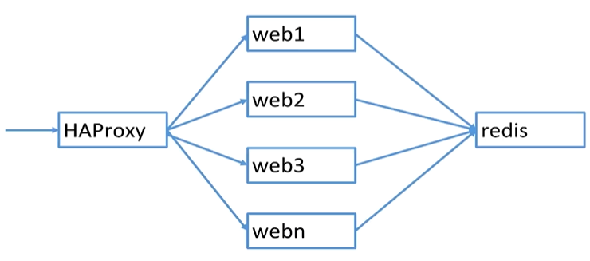

Dockerfile 

    FROM python:2.7
    LABEL maintaner="Peng Xiao xiaoquwl@gmail.com"
    COPY . /app
    WORKDIR /app
    RUN pip install flask redis
    EXPOSE 80
    CMD [ "python", "app.py" ]
    
yml

    version: "3"
    
    services:
    
      redis:
        image: redis
    
      web:
        build:
          context: .
          dockerfile: Dockerfile
        ports: ["8080"]
        environment:
          REDIS_HOST: redis
    
      lb:
        image: dockercloud/haproxy
        links:
          - web
        ports:
          - 80:80
        volumes:
          - /var/run/docker.sock:/var/run/docker.sock 
          
这里面我们增加了 HAProxy 是一个免费的负载均衡软件

    docker-compose up -d #启动容器
    docker-compose ps # 查询容器情况
    docker-compose up --scale web=3 -d #起3个web服务
    
打开浏览器,轮询负载均衡成功

    Hello Container World! I have been seen 22 times and my hostname is 697a48224abe.
    Hello Container World! I have been seen 23 times and my hostname is a2483596aa10.
    Hello Container World! I have been seen 24 times and my hostname is 31e843942e82.
    
## 部署一个复杂的投票应用

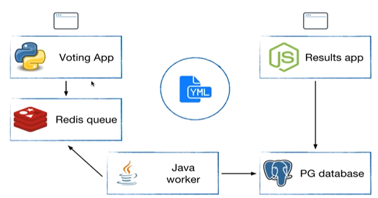

yml文件

    version: "3"
    
    services:
      voting-app:
        build: ./voting-app/.
        volumes:
         - ./voting-app:/app
        ports:
          - "5000:80"
        links:
          - redis
        networks:
          - front-tier
          - back-tier
    
      result-app:
        build: ./result-app/.
        volumes:
          - ./result-app:/app
        ports:
          - "5001:80"
        links:
          - db
        networks:
          - front-tier
          - back-tier
    
      worker:
        build: ./worker
        links:
          - db
          - redis
        networks:
          - back-tier
    
      redis:
        image: redis
        ports: ["6379"]
        networks:
          - back-tier
    
      db:
        image: postgres:9.4
        volumes:
          - "db-data:/var/lib/postgresql/data"
        networks:
          - back-tier
    
    volumes:
      db-data:
    
    networks:
      front-tier:
      back-tier:
      
解读

    1. networks有2个这里没有指明网络类型,默认是Bridge
    2. services中voting-app和result-app都是连接2个网络一个front-tier对外的网络,back-tier对内网络
    
docker-compose建议是本地开发环境使用,不用于生产环境。

# 第7章 容器编排Docker Swarm

## 容器编排Swarm介绍

swarm mode

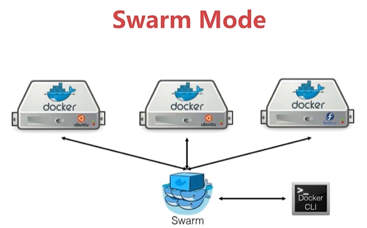

swarm 架构

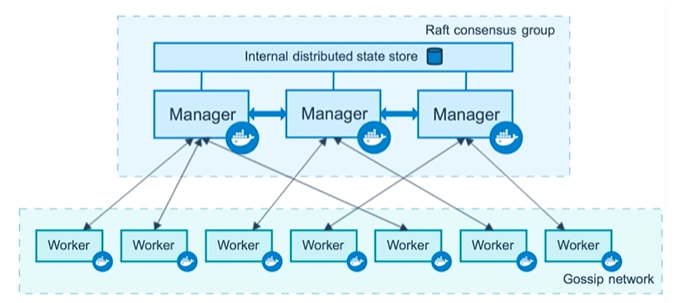

service和replicas

服务创建和调度

## 创建一个三节点的swarm集群

先创建3台虚拟机

    docker-machine create swarm-manager
    docker-machine create swarm-worker1
    docker-machine create swarm-worker2
    
进入虚拟机

    docker-machine ssh swarm-manager
    
先初始化一个manager节点

    docker swarm init --advertise-addr=IP地址
    
打印出

进入swarm-worker1,运行 docker swarm jion

    docker-machine ssh swarm-worker1
    docker swarm jion --token SWMTKN........
    
进入swarm-manager节点,查看节点

    docker node ls
    
接下来就是在swarm-worker2运行docker swarm jion

    docker-machine ssh swarm-worker2
    docker swarm jion --token SWMTKN........

进入swarm-manager节点,查看节点

    docker node ls
    
## Service的创建维护和水平扩展

创建一个 Service(容器)

    docker Service create --name demo 镜像image

查看 Service(容器)

    docker Service ls
    
REPLICAS意思

    说明这个 Service 是可以扩展的
    
扩展 Service(容器)

    docker Service scale demo=5
    
我们想看这个 Service 在哪台机器上

    docker Service ps demo
    
强制删除 Service(容器),发现过一会容器有扩展成5个了.

    docker rm -f 容器id
    docker Service ls
    
删除 Service(容器)

    docker Service rm demo
    
## 在swarm集群里通过service部署wordpress

先创建 overldy 网络

    docker network create -d overldy demo
    docker network ls
    
创建一个 service mysql容器 --mount相当于--v
    
    docker service create --name mysql --env MYSQL_ROOT_PASSWORD=root --env MYSQL_DATABASE=wordPress 
        --network demo --mount type=volume,source=mysql-data,destination=/var/lib/mysql mysql
        
起一个 WordPress 

    docker service create --name wordPress -p 80:80 --env WORDPRESS_DB_PASSWORD=root --env WORDPRESS_DB_HOST=mysql 
        --network demo wrodpress
        
我们查看网络,发现3台机器的网络同步了,这就是swarm的机制,类似于上面讲到的etcd实现分布式存储

    docker network ls
    
## 集群服务间通信之Routing Mesh

2台机器之间通信,是可以service name进行访问的

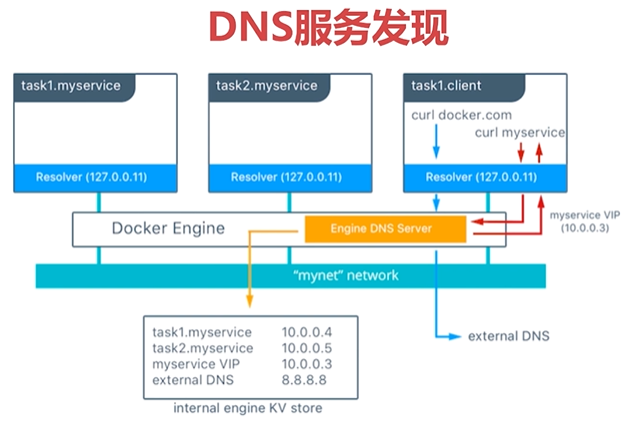

    internal:container和container之间的访问通过overlay网络(通过vip虚拟ip)
    
    ingress:如果服务有绑定接口,则此服务可以通过任意searm节点的相应接口访问
    

访问流程,vip虚拟网络

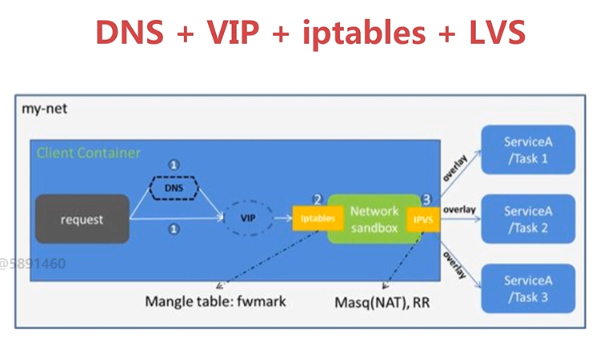

## Routing Mesh之Ingress负载均衡

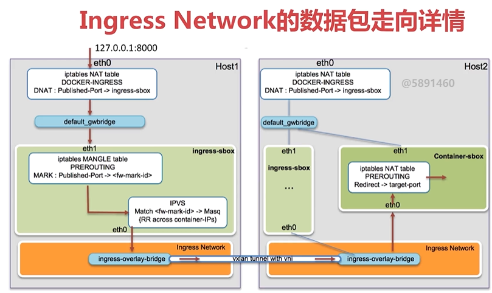

## Docker Stack部署Wordpress

compose file v3.3增加了deploy

参数 endpoint_mode:vip

    虚拟vip 映射真实的ip地址
    
参数 endpoint_mode:dnsrr

    循环访问 真实的ip地址
    
参数 labels

    描述信息
    
参数 mode

    global:不能横向扩展
    replicated:能扩展
    
参数 placement

    设置容器部署的限制条件
    
参数 replicas

    定义初始化多少个容器
    
参数 resource

    资源的限制
    
参数 restart_policy

    延迟,重启的条件限制
    
参数 update_config

    更新条件
    
现在我们部署一台WordPress,进入manager节点

    docker-machine ssh swarm-manager
    
yml文件

    version: '3'
    
    services:
    
      web:
        image: wordpress
        ports:
          - 8080:80
        environment:
          WORDPRESS_DB_HOST: mysql
          WORDPRESS_DB_PASSWORD: root
        networks:
          - my-network
        depends_on:
          - mysql
        deploy:
          mode: replicated
          replicas: 3
          restart_policy:
            condition: on-failure
            delay: 5s
            max_attempts: 3
          update_config:
            parallelism: 1
            delay: 10s
    
      mysql:
        image: mysql:5.7
        environment:
          MYSQL_ROOT_PASSWORD: root
          MYSQL_DATABASE: wordpress
        volumes:
          - mysql-data:/var/lib/mysql
        networks:
          - my-network
        deploy:
          mode: global
          placement:
            constraints:
              - node.role == manager
    
    volumes:
      mysql-data:
    
    networks:
      my-network:
        driver: overlay
        
运行yml文件deploy wordpress(自定义项目名)

    docker stack deploy wordpress --compose-file=docker-compose.yml
    
    docker stack ps wordpress
    
    docker stack services wordpress
    
    docker stark rm wordpress
    
## 部署投票应用

yml文件,这里要注意stack命令不能进行build出镜像,现在用的镜像是从dockerhub拉取的

    version: "3"
    services:
    
      redis:
        image: redis:alpine
        ports:
          - "6379"
        networks:
          - frontend
        deploy:
          replicas: 2
          update_config:
            parallelism: 2
            delay: 10s
          restart_policy:
            condition: on-failure
    
      db:
        image: postgres:9.4
        volumes:
          - db-data:/var/lib/postgresql/data
        networks:
          - backend
        deploy:
          placement:
            constraints: [node.role == manager]
    
      vote:
        image: dockersamples/examplevotingapp_vote:before
        ports:
          - 5000:80
        networks:
          - frontend
        depends_on:
          - redis
        deploy:
          replicas: 2
          update_config:
            parallelism: 2
          restart_policy:
            condition: on-failure
    
      result:
        image: dockersamples/examplevotingapp_result:before
        ports:
          - 5001:80
        networks:
          - backend
        depends_on:
          - db
        deploy:
          replicas: 1
          update_config:
            parallelism: 2
            delay: 10s
          restart_policy:
            condition: on-failure
    
      worker:
        image: dockersamples/examplevotingapp_worker
        networks:
          - frontend
          - backend
        deploy:
          mode: replicated
          replicas: 1
          labels: [APP=VOTING]
          restart_policy:
            condition: on-failure
            delay: 10s
            max_attempts: 3
            window: 120s
          placement:
            constraints: [node.role == manager]
    
      visualizer:
        image: dockersamples/visualizer:stable
        ports:
          - "8080:8080"
        stop_grace_period: 1m30s
        volumes:
          - "/var/run/docker.sock:/var/run/docker.sock"
        deploy:
          placement:
            constraints: [node.role == manager]
    
    networks:
      frontend:
      backend:
    
    volumes:
      db-data:
      
运行

    docker stack deploy example --compose-file=docker-compose.yml
    
visualizer

    可视化工具
    
## Docker Secret管理和使用

密码管理

我们上面部署的WordPress的docker-compose存在

      WORDPRESS_DB_HOST: mysql
      WORDPRESS_DB_PASSWORD: root
      
有没有安全保存方式,就是Secret

什么是Secret

    用户名密码
    ssh key
    tls认证
    任何不想让别人看到的数据
    
docker swarm mode architecture

    存在swarm manager节点 redt database里
    secret可以assign给一个service,这个service就能看到这个secret
    在container内部secret看起来像文件,但是实际是在内存中
    
创建一个secret

可以通过文件方式创建

    vim password 
        admin123
    docker secret create my-pw password
    ls
    rm -rf password
    docker secret ls
    
通过命令方式

    echo "admin123" | docker secret create my-pw2 -
    docker secret ls
    
怎么使用

    docker service create --name client --secret my-pw 镜像id
    
    # 进入容器查看 secret
    docker exec -it 容器id /bin/bash
    cd /run/secrets/
    ls
        my-pw
    cat my-pw
        admin123
        
mysql的例子

    docker service create --name db --secret my-pw -e MYSQL_ROOT_PASSWORD_FILE=/run/secrets/my-pw mysql
    
    # 测试登录mysql
    mysql -u root -p 
        admin123
        
## Docker Secret在Stack中的使用

我们用docker-compose定义了一个stack,用docker stack实现了容器的创建,下面将Secret集成进来

    version: '3'
    
    services:
    
      web:
        image: wordpress
        ports:
          - 8080:80
        secrets:
          - my-pw
        environment:
          WORDPRESS_DB_HOST: mysql
          WORDPRESS_DB_PASSWORD_FILE: /run/secrets/my-pw
        networks:
          - my-network
        depends_on:
          - mysql
        deploy:
          mode: replicated
          replicas: 3
          restart_policy:
            condition: on-failure
            delay: 5s
            max_attempts: 3
          update_config:
            parallelism: 1
            delay: 10s
    
      mysql:
        image: mysql
        secrets:
          - my-pw
        environment:
          MYSQL_ROOT_PASSWORD_FILE: /run/secrets/my-pw
          MYSQL_DATABASE: wordpress
        volumes:
          - mysql-data:/var/lib/mysql
        networks:
          - my-network
        deploy:
          mode: global
          placement:
            constraints:
              - node.role == manager
    
    volumes:
      mysql-data:
    
    networks:
      my-network:
        driver: overlay
        
创建

    docker stack deploy wordpress -c=docker-compose.yml
    
    docker stack services wordpress
    
## Service更新

在swarm下,用 docker service创建的一个service还是用doker stack创建的一堆service,那么需要更新怎么做

起一个service

    docker Service create --name web --publish 8080:5000 --network demo xiaopeng163/python-flask-demo:1.0
    docker service scale web=2
    
更新镜像文件并启动

    docker service update --image xiaopeng163/python-flask-demo:2.0
    
因为这里面更新是需要时间的,会存在2个服务版本1和版本2同时存在的情况

端口的更新

    docker service update --publish-rm 8080:5000 --publish-add 8088:5000 web
    
如果通过stack部署的,我们只需要改变docker-compose文件内容,deploy后还是会更新

    docker stack deploy wordpress --compose-file=docker-compose.yml

# 第8章 DevOps初体验——Docker Cloud和Docker企业版

## Docker Cloud简介

    提供容器的管理,编排,部署的托管的服务
    
2种模式

    stacdard模式,一个node就是一个docker host
    swarm模式,多个node组成的swarm cluster
    

## Docker Cloud之自动build Docker image

进入设置界面管理git账户

    https://cloud.docker.com/u/aiyingfeng110/settings
    
创建一个Organizations

    https://cloud.docker.com/orgs
    
创建 Repository

    https://cloud.docker.com/u/aiyingfeng/repository/create
    
builds选择github上关联项目

    构建并保存
    
注意:
    
    代码同步了dockerhub
    github修改文件,Docker Cloud马上会构建新的镜像
    
修改自动部署配置,增加tag

这样就会在版本更新时 Build 

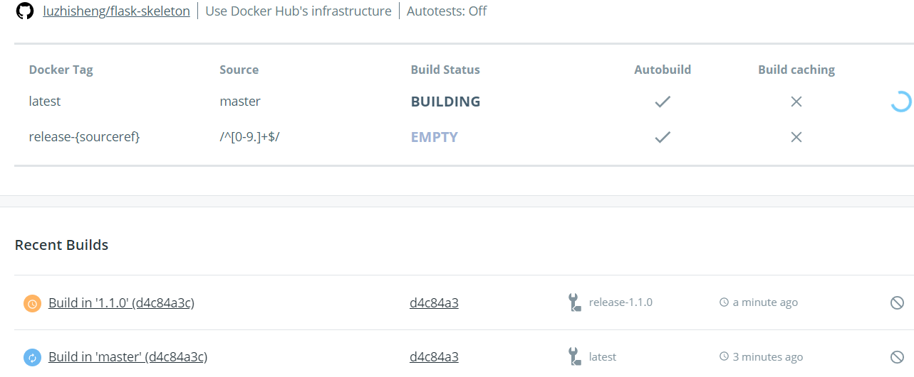

## Docker Cloud之持续集成和持续部署

从开发到部署 launch service
    
    本地修改代码-->github-->docker Cloud
    
## Docker企业版的在线免费体验

https://www.docker.com/products/docker-enterprise

## Docker企业版本地安装之UCP

    网页版的docker swarm

## Docker企业版本地安装之DTR

    网页版的镜像管理
    
## Docker企业版UCP的基本使用演示
    
## 体验阿里云的容器服务

    https://www.aliyun.com/product/containerservice?spm=5176.8112568.cwnn_jpze.20.3be79ed5LqqIVl

## 在阿里云上安装Docker企业版

## Docker企业版DTR的基本使用演示

# 第9章 容器编排Kubernetes

k8s架构

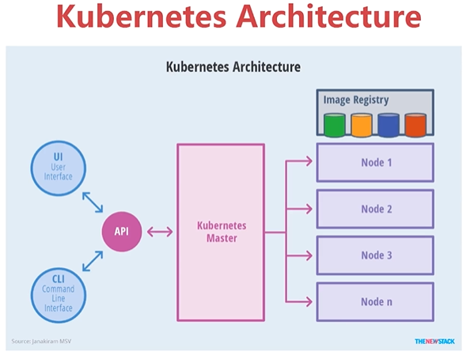

## Minikube快速搭建K8S单节点环境

minikube的主要目标是成为本地Kubernetes应用程序开发的最佳工具

minikube 依赖本地的VirtualBox

    文档  https://github.com/kubernetes/minikube
    
在Linux上安装kubectl

    文档  https://kubernetes.io/docs/tasks/tools/install-kubectl/#install-kubectl-on-linux
    
安装 minikube

    文档 https://kubernetes.io/docs/tasks/tools/install-minikube/#install-a-hypervisor
    
minkube 命令

    minikube version
    minikube start #创建单节点k8s集群
    
使用kubectl，可以检查集群资源; 创建，删除和更新组件。

    kubectl config view # 配置信息
    kubectl config get-contexts  #查看上下文配置
    kubectl cluster-info # 当前集群状态
    
进入虚拟机
    
    minikube ssh
    
## K8S最小调度单位Pod

在k8s中我们不对容器直接操作,因为pod已经是最小单位了

定义一个pod_nginx.yml文件 

    apiVersion: v1
    kind: Pod
    metadata:   # 基本信息
      name: nginx
      labels:
        app: nginx
    spec:      # 容器
      containers:
      - name: nginx
        image: nginx
        ports:
        - containerPort: 80

运行文件

    kubectl version # 查看k8s节点信息
    kubectl create -f pod_nginx.yml # 创建一个pod
    kubectl dalete -f pod_nginx.yml # 删除一个pod
    kubectl get pods # 查看pod
    
实际上pods里面运行一个容器

    kubectl get pods -o wide
    
进入容器

    minikube ssh
    docker ps
    docker exec -it 容器id sh
    
    # 使用docker命令查询其他信息
    docker network ls
    docker network inspect bridge
    
也可以通过对一个pod进行exec

    kubectl exec -it nginx sh

打印容器信息

    kubectl describe pods nginx
    
进入 minikube ping nginx端口

    minikube ssh
    kubectl describe pods nginx 查询信息
    ping 172.0.xxx.xx
    
我们需要让外界访问,而不是在minikube中

    minikube ssh
    ip a
    
    kubectl port-forward nginx 8080:80
    
## ReplicaSet和ReplicationController

横向扩展ReplicaSet新版本, ReplicationController老版本

### ReplicationController

rc_nginx.yml 起了3个replicas

    apiVersion: v1
    kind: ReplicationController 
    metadata:
      name: nginx
    spec:
      replicas: 3
      selector:
        app: nginx
      template:
        metadata:
          name: nginx
          labels:
            app: nginx
        spec:
          containers:
          - name: nginx
            image: nginx
            ports:
            - containerPort: 80

创建一个pod

    kubectl create -f rc_nginx.yml
    
查看信息
    
    kubectl get rc
    kubectl get pods
    
有了 ReplicationController 我们删除一个pod,还会自动创建一个pod

    kubectl delete pods nginx-xxxxx
    kubectl get pods
    
横向扩展

    kubectl scale rc nginx --replicas=4
    kubectl get pods

这里我起了4个pod,每个pod都监听的ip地址,在swarm中有一个vip做负载均衡

### ReplicaSet

yml文件

    apiVersion: apps/v1
    kind: ReplicaSet
    metadata:
      name: nginx
      labels:
        tier: frontend
    spec:
      replicas: 3
      selector:
        matchLabels:
          tier: frontend
      template:
        metadata:
          name: nginx
          labels:
            tier: frontend
        spec:
          containers:
          - name: nginx
            image: nginx
            ports:
            - containerPort: 80

创建pod

    kubectl create -f rs_nginx.yml
    
查看

    kubectl get rs
    kubectl get pods

横向扩展

    kubectl scale rs nginx --replicas=4
    
## Deployment
    
Deployment 为Pod 和 ReplicaSet 之上，提供了一个声明式定义（declarative）方法，用来替代以前的ReplicationController 来方便的管理应用

文档 https://kubernetes.io/zh/docs/tasks/run-application/run-stateless-application-deployment/

deployment_nginx.yml

    apiVersion: apps/v1
    kind: Deployment
    metadata:
      name: nginx-deployment
      labels:
        app: nginx
    spec:
      replicas: 3
      selector:
        matchLabels:
          app: nginx
      template:
        metadata:
          labels:
            app: nginx
        spec:
          containers:
          - name: nginx
            image: nginx:1.12.2
            ports:
            - containerPort: 80

创建 

    kubectl create -f deployment_nginx.yml
    kubectl get deployment
    kubectl get deployment -o wide
    kubectl get rs
    kubectl get pods
    
升级

    kubectl set image deployment nginx-deployment nginx=nginx:1.13
    
    # 查询信息
    kubectl get deployment
    kubectl get deployment -o wide
    
    # 发现有2个
    kubectl get rs
    
    # 回滚
    kubectl rollout undo deployment nginx-deployment
    
    # 回到nginx:1.13版本
    kubectl set image deployment nginx-deployment nginx=nginx:1.13
    
这样是容易更新版本并回到任何一个版本

### 实现对外访问

查询节点

    kubectl get node -o wide
    
端口暴露

    kubectl delete deployment nginx-deployment
    kubectl expose deployment nginx-deployment --type=NodePort
    
查询服务

    kubectl get svc
    
## 使用Tectonic在本地搭建多节点K8S集群

文档 https://coreos.com/tectonic/

## k8s基础网络Cluster Network

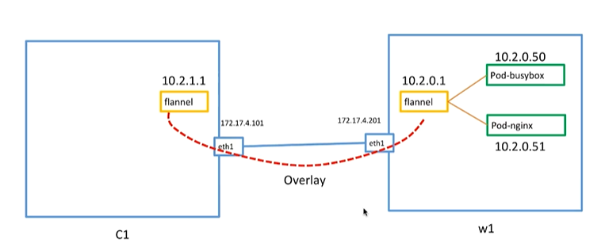

在k8s集群上任何一台机器能ping通另一台机器

每个pod都是有ip地址,这些ip地址都是可以ping通的

    文档 https://kubernetes.io/docs/concepts/cluster-administration/networking/
    
## Service简介和演示

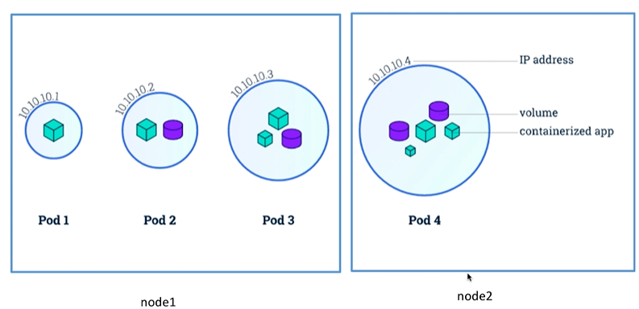

当我们使用replicaset或者热replicationcontroller做水平扩展scale的是时候,pods有可能
被销毁

当我们使用deployment的时候,我们去更新docker image version, 旧的pods会被销毁,然后新的pods创建

    简单的说就是我有一个web服务,连接的是mysql服务,如果mysql更新版本,那么ip也会变,
    这样我们web服务也样更新连接数据库的ip地址,这是不合理的,Service就解决这个问题
    
Service

    kubectl expoese命令,会给我们的pod创建一个service,供外部访问
    service主要有三种类型,一种叫cluster ip,一种nodeport,一种叫外部的loadbalancer
    另外也可以使用dns,但是需要dns的add-on
    
### clusterip

    只有cluster才能访问的ip,这个clusterip是不能变的,pod的ip是可以变的,clusterip是不会变了
    
1.给nginx-pod创建一个Service

    kubectl expose pods nginx-pod
    kubectl get svc # 查询Service
    
2.新的一个例子 deployment_python_http.yml

    apiVersion: extensions/v1beta1
    kind: Deployment
    metadata:
      name: service-test
    spec:
      replicas: 2
      selector:
        matchLabels:
          app: service_test_pod
      template:
        metadata:
          labels:
            app: service_test_pod
        spec:
          containers:
          - name: simple-http
            image: python:2.7
            imagePullPolicy: IfNotPresent
            command: ["/bin/bash"]
            args: ["-c", "echo \"
Hello from $(hostname)
\" > index.html; python -m SimpleHTTPServer 8080"]
            ports:
            - name: http
              containerPort: 8080

创建一个 Deployment

    kubectl create -f deployment_python_http.yml
    kubectl get pods
    kubectl get pods -o wide
    
给Deployment创建一个Service

    kubectl expose deployment service-test
    kubectl get svc # 查询Service
    
集群的其他机器访问Service

    curl ip地址
    
3.通过Deployment无宕机更新

    kubectl edit deployment service-test
    vim 修改文件

## NodePort类型Service以及Label的简单实用

nodeport

    外部可以访问的

pod_nginx.yml

    apiVersion: v1
    kind: Pod
    metadata:
      name: nginx-pod
      labels:
        app: nginx
    spec:
      containers:
      - name: nginx-container
        image: nginx
        ports:
        - name: nginx-port
          containerPort: 80

创建一个pod

    kubectl create -f pod_nginx.yml
    
创建一个Service

    kubectl expose pods nginx-pod --type=NodePort
    kubectl get svc
    kubectl delete service nginx-pod
    
访问

    节点id地址:端口
    
除了用expose,也可以用yml文件创建Service service_nginx.yml

    apiVersion: v1
    kind: Service
    metadata:
      name: nginx-service
    spec:
      ports:
      - port: 32333
        nodePort: 32333
        targetPort: nginx-port
        protocol: TCP
      selector:
        app: nginx
      type: NodePort

访问

    节点id地址:端口
    
### Label的简单实用

在k8s中所有的资源都可以是labels

我们创建一个Pod

    apiVersion: v1
    kind: Pod
    metadata:
      name: busybox-pod
      labels:
        app: busybox
    spec:
      nodeSelector:
        hardware: good
      containers:
      - name: busybox-container
        image: busybox
        command:
          - sleep
          - "360000"

查询运行情况,发现这个pod是pending

    kubectl get pods
    
查询node的labels

    kubectl get node
    kubectl get node --show-labels
    
因为busybox-pod找不到node有匹配的labels, 设置node的labels

    kubectl label node w1.tectonicsandbox.com hardware: good
    kubectl get pods
    
loadbalancer

    一般云服务商提供的,我在阿里云上通过他们的提供负载均衡loadbalancer服务,端口暴露给loadbalancer
    
## 准备工作——使用kops在亚马逊AWS上搭建k8s集群

文档 https://github.com/kubernetes/kops

    kops生产级别安装,管理工具,开源
    可以在环境中搭建k8s集群
    
本地安装

    centos
    kops
    aws客户端
    
AWS上配置权限管理

    LAM
    
配置aws

    aws configure
    
检测域名是否能访问

    dig +short xxx.link soa
    dig +short xxx.link ns
    
亚马逊AWS上创建子域名

    k8s.xxx.link
    
检测域名是否能访问

    dig +short k8s.xxx.link soa
    dig +short k8s.xxx.link ns    

创建一个s3 bucket

    阿里云oss 
    kops.k8s.xxx.link
    
## 使用kops在亚马逊AWS上搭建k8s集群

创建一个ssh
    
    ssh-keygen -f .ssh/id_rsa
    cd .ssh/
    
生成状态配置

如果配置不正确删除

    kops delete cluster --name=k8s.imooc.link --state=s3://kops.k8s.xxx.link --yes
    
将命令执行到aws上

    kops update cluster k8s.xxx.link --yes --state=s3://kops.k8s.xxx.link
    
验证aws状态

    kops validate cluster --state=s3://kops.k8s.xxx.link
    
pod.yml

    apiVersion: v1
    kind: Pod
    metadata:
      name: nginx-pod
      labels:
        app: nginx
    spec:
      containers:
      - name: nginx-container
        image: nginx
        ports:
        - name: nginx-port
          containerPort: 80
          
创建一个pod
    
    kubectl create -f pod.yml
    kubectl get pods
    kubectl get pods -o wide
    
进入pod,api.k8s.xxx.link指向就是master节点

    ssh -i ~/.ssh/id_rsa admin@api.k8s.xxx.link
    ping ip测试
    
创建一个service,并端口暴露,去aws端口打开

    kubectl expose pod pod的name --type=NodePort
    kubectl get svc
    
访问
    
    curl api.k8s.xxx.link:31235

## LoadBlancer类型Service以及AWS的DNS服务配置

先删除上一个Service

    kubectl delete Service nginx-pod
    
创建一个LoadBlancer类型Service

    kubectl expose pod pod的name --type=LoadBlancer
    kubectl get svc
    
会在aws上创建LoadBlancer

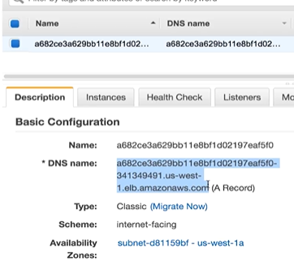

浏览器访问ok

也可以域名绑定LoadBlancer

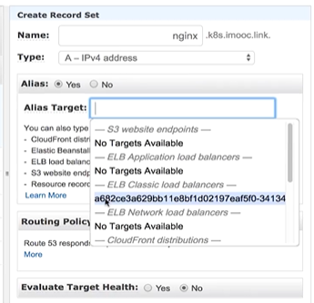

## 在亚马逊k8s集群上部署wordpress

yaml文件

    mysql-deployment.yaml
    wordpress-deployment.yaml
    
首先要先创建一个 secret

    kubectl create secret generic mysql-pass --from-literal=password=123456
    
    kubectl get secret
    
创建完后,创建mysql服务

    kubectl create -f mysql-deployment.yaml
    
    kubectl get svc
    kubectl get pods
    
创建wordpress服务

    kubectl create -f wordpress-deployment.yaml
    
    进入容器
    kubectl exec -it xxx bash
    
# 第10章 容器的的运维和监控

## 容器的基本监控

查询单个容器进程情况

    docker top 容器id
    
docker 容器占用本机cpu 内存情况

    docker stats
    
可视化工具 weavescope 监控

    sudo curl -L git.io/scope -o /usr/local/bin/scope
    sudo chmod +x /usr/local/bin/scope
    
    scope launch 192.168.210.10
    
## k8s集群运行资源监控——Heapster+Grafana+InfluxDB

Heapster开源免费

    https://github.com/kubernetes-retired/heapster
    
## 根据资源占用自动横向伸缩

## k8s集群Log的采集和展示——ELK+Fluentd

## k8s集群监控方案Prometheus

# 第11章 Docker+DevOps实战——过程和工具

## 搭建GitLab服务器

文档 https://about.gitlab.com/installation

文档 https://git.imooc.com/coding-189/coding-189/src/master/chapter11/labs/gitlab-server.md

## 搭建GitLab CI服务器和Pipeline演示

我们选择GitLab版本管理,那么选择GitLab CI优于Jenkins

文档 https://git.imooc.com/coding-189/coding-189/src/master/chapter11/labs/gitlab-ci.md

## 基于真实Python项目的CI演示

## 使用Python项目演示的CICD流程

## CI实现版本自动发布

文档 https://git.imooc.com/coding-189/coding-189/src/master/chapter11/labs/registry.md
